# Posters

### Posters

Poster templates can be found on the project’s google disk. Agreed resolution for a poster is 600x900 pixels (or 900x600 pixels for horizontal ones).

In case of posters, the guideline on the amount of details is somewhat lighter, but it’s still encouraged to not create too much visual noise.

Pictured below: Standard NT posters, in pallet’s colors and with sleek vector shapes.

<figure><figcaption></figcaption></figure>

 

<figure>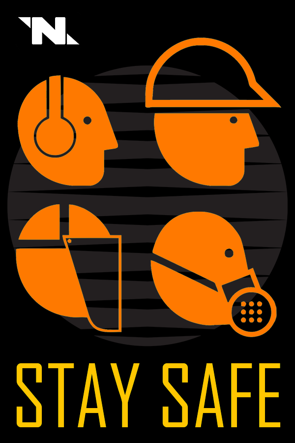<figcaption></figcaption></figure>

 

<figure><figcaption></figcaption></figure>

 

<figure>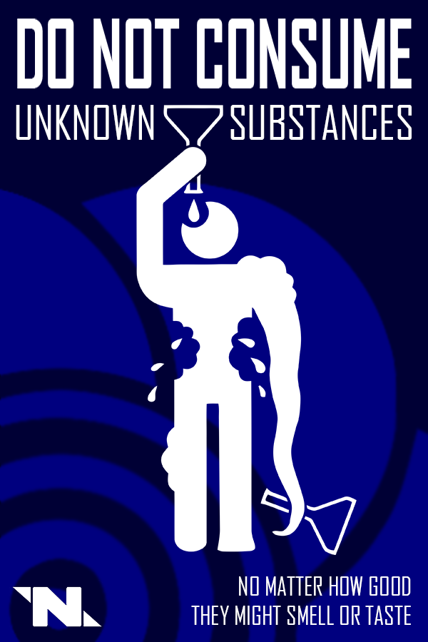<figcaption></figcaption></figure>

Pictured below: Various posters in cartoonish vector styles.

<figure>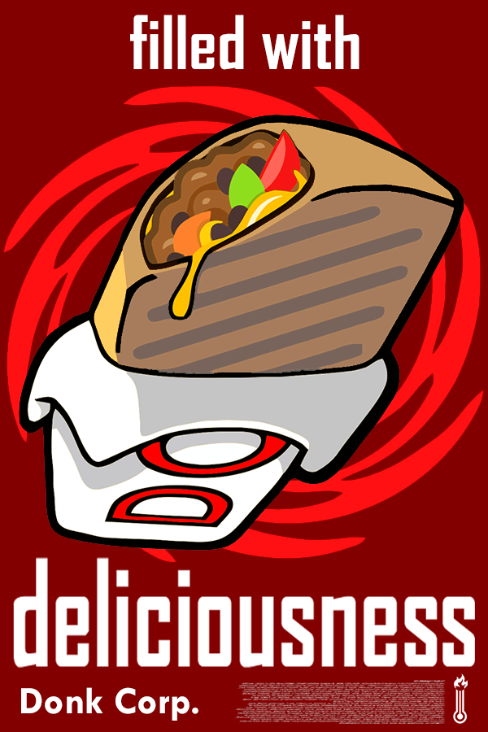<figcaption></figcaption></figure>

 

<figure>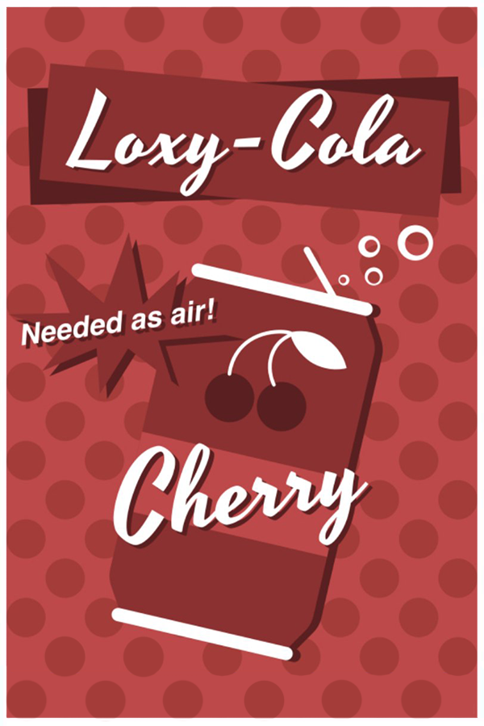<figcaption></figcaption></figure>

 

<figure><figcaption></figcaption></figure>

 

<figure>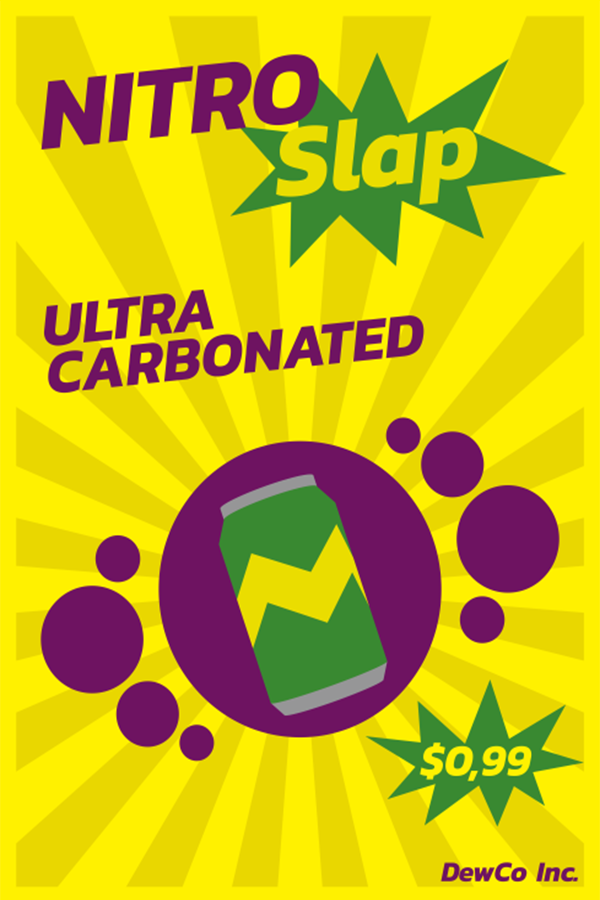<figcaption></figcaption></figure>

Pictured below: Various posters, utilizing actual rendered models from the game.

<figure>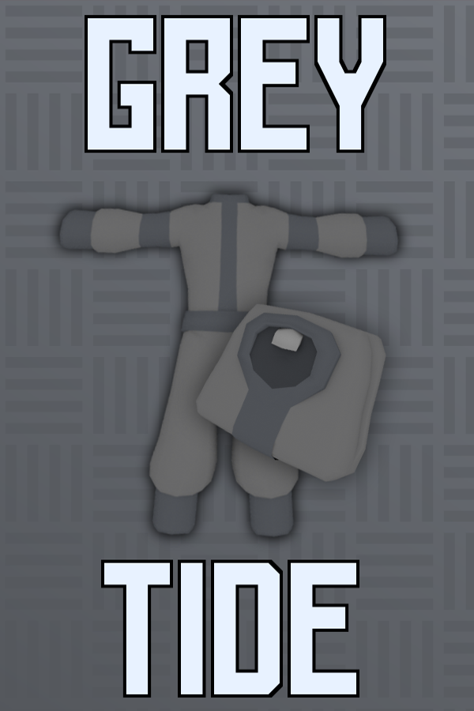<figcaption></figcaption></figure>

 

<figure>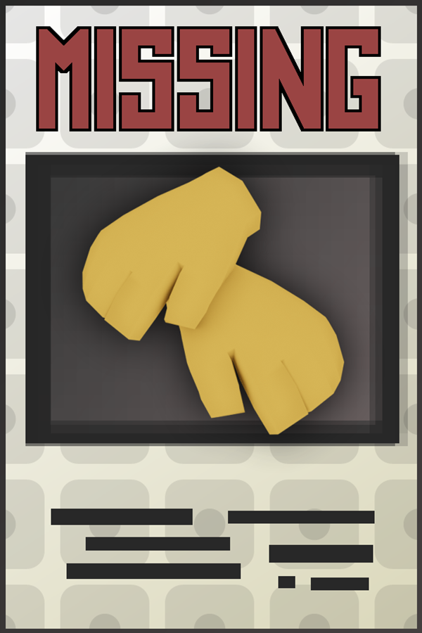<figcaption></figcaption></figure>

 

<figure>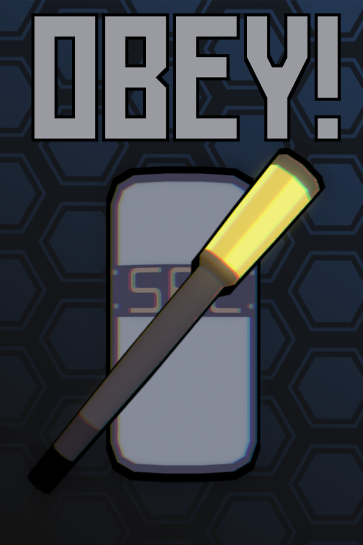<figcaption></figcaption></figure>

 

<figure><figcaption></figcaption></figure>

Pictured below: Poster art in a variety of styles.

<figure>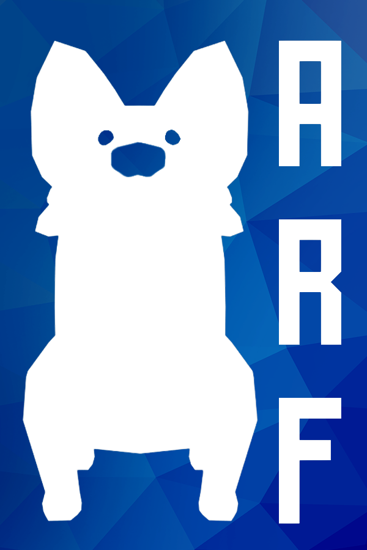<figcaption></figcaption></figure>

 

<figure><figcaption></figcaption></figure>

 

<figure>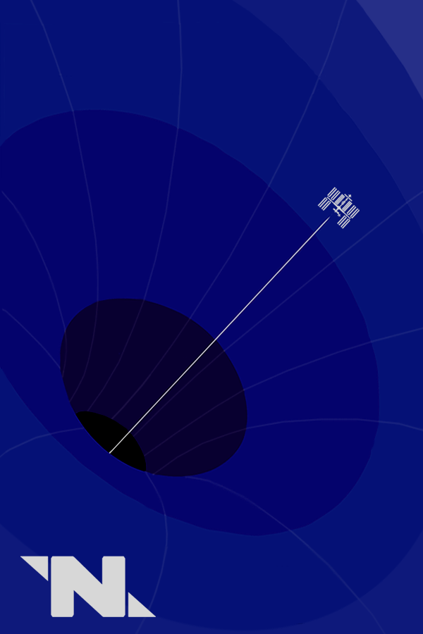<figcaption></figcaption></figure>

 

<figure>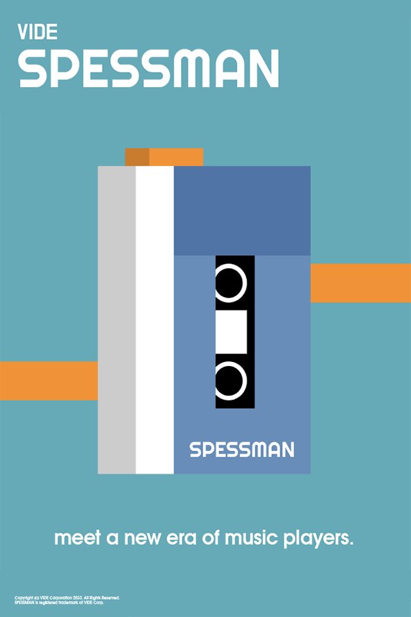<figcaption></figcaption></figure>

(add some examples of horizontal posters)
