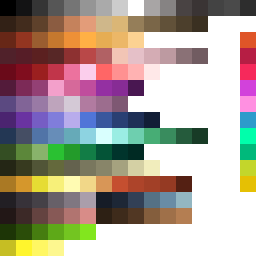

# Color

## Color

Coloring models helps give more character and even depth to 3D models.

### Palette

Having a palette has many upsides. It removes the need to learn texturing and also UV unwrapping, which is a tedious mechanical process that would raise the entry barrier to making SS3D content.&#x20;

It makes it really easy to try different color variations, and it helps with cohesion.

### Baked in shadows

By coloring parts of the mesh with a darker shade of the same color you give the impression that it's casting a shadow on itself.

Old games did this a lot, but it should be used very sparingly— it can look very wrong when light shines directly on the darkened part.&#x20;

The disposals bin can’t rotate, so it’s safe to assume light will be hitting it from above.

### Using the Palette

At this point the model has no UV mapping. Select all faces and press `U` > `Reset` which is the most unwrapping you’ll need for most things.

Make sure everything is selected in the UV editor then scale it all down into a single point (press `S` the `0`). Now select the faces you want to color, then drag the corresponding points in the UV editor to a swatch in the palette.

.png>)\
