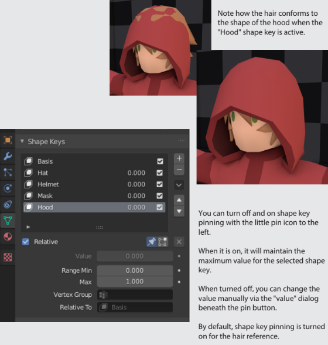

# Getting Started

## Understanding the Rigging Template

The rigging template includes a myriad of clothing items that you can use as reference for creating your own.

Because clothing items aren't always worn, jumpsuits, shirts, pants, shoes, gloves, neck items, oversuits and some types of hats need secondary variants to be held and placed as items around the map.

<figure><figcaption></figcaption></figure>

The reference models in the rigging template serve 3 purposes:

1. To supply modelers with a basis for articles of clothing.
2. To ensure that your hair shape keys fit within the constraints of a hat.
3. To serve as a reference for origin placement.

The Contents of the rigging template:

* Human model featuring all cutoff points and shape keys.
* References for head-worn items.
* Reference hairstyle with shape keys.
* All applicable materials.
* References for jumpsuit, gloves, and shoes.
* References for held clothing items.
* References for jumpsuit shape keys.

### Shape Keys

The reference items are not only for viewing purposes, they also serve as an example for the formatting of things such as **shape keys**. Shape keys store positions for vertices, and are used for functions such as hiding hair under hats, helmets, hoods, and masks.

<figure><figcaption></figcaption></figure>

You can check what shape keys an item needs by clicking the  tab while any of the reference items are selected. When creating an item of the same type as one of the reference items, follow the naming convention exactly, including the order of the shape keys.

To edit shape keys on an item, simply click the desired shape key in Edit Mode, then move the vertices to the desired position as per each key.

**TIP:** You can use destructive and light constructive editing on the provided clothing items to make something new, while still maintaining clean armature weighting. However, too many changes in the geometry may result in needing to recreate shape keys.

## Understanding the Basics

This section will cover basic things you will need to know in order to progress in this guide.

<figure><figcaption></figcaption></figure>

### Rigging

To rig an item, you must select the mesh, then select the armature, and press CTRL+P. This will bring up the following menu:

<figure><figcaption></figcaption></figure>

"**Empty Groups**" creates a parenting with weights equal to zero, which is helpful for making things that are weighted to only one bone, like hats.

"**Automatic Weights**" does its best to automatically calculate which bone attaches to which vertex. Often produces undesired effects, but may be useful.

### Weighting

"Weighting" in 3D modeling refers to the amount of influence a bone has over a vertex. Typically, a weighting of 1 means "this bone has maximum influence," while a weighting of 0 means "this bone has no influence." However, more than one bone may be weighted to the same vertex.

<figure><figcaption>
These vertices are weighted to the "bicep_r" bone. The warmer the color, the more influence the bone has.
</figcaption></figure>

**You can manually set the values of vertices** to bones by clicking the  button in Edit Mode, finding the desired bone in the list of vertex groups, selecting the vertices you wish to assign, then setting the weight and clicking assign.

<figure><figcaption></figcaption></figure>

