# Textures

SS3D models mostly use a color palette in place of actual textures, as it negates the need to learn texturing and UV unwrapping, helps with cohesion and supports a unique style of SS3D.

For simpler stuff it might be best to use colored polygons, as pictured on a few examples below:

<figure><figcaption>
An few asian-looking symbols made out of colored polygons.  
</figcaption></figure>

Do not worry, the render settings make those look seamless, unless the seam is needed. For more info on that, consult the 3D Modeling Guidelines document.

Though do remember that items will be seen from pretty far away, so zoom out early and often, and always look at your work from all angles.&#x20;

## Actual Textures

However, textures may be used for some specific cases. For example, repeating patterns, complex shapes or where cutting up the model to add colors may cause problems.

One of such examples: HumanSeveredLimb.png (256x256) used as a texture for flesh cross section with a bone in the middle.

<figure><figcaption>
HumanSeveredLimb texture applied to a model
</figcaption></figure>

 

<figure><figcaption>
HumanSeveredLimb.png
</figcaption></figure>

Another example: a cowhide texture Cow.png (256x256)&#x20;

<figure>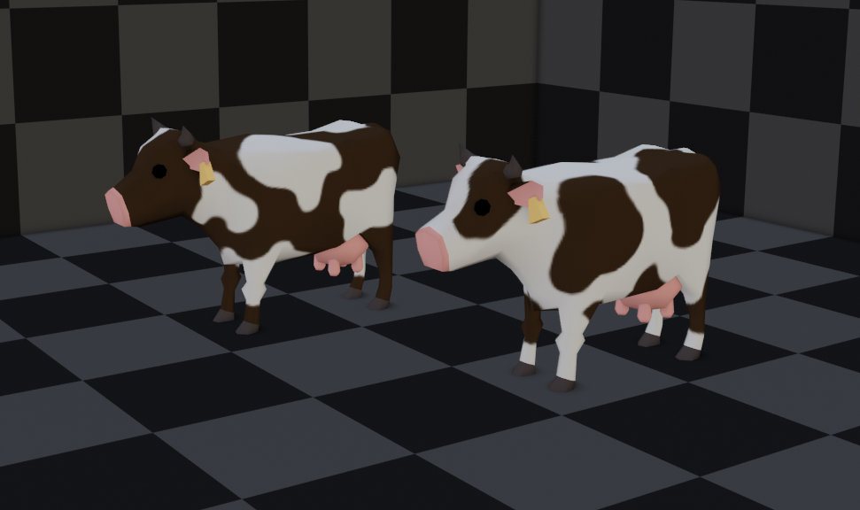<figcaption>
Textured cows
</figcaption></figure>

 

<figure>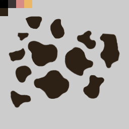<figcaption>
White cow texture
</figcaption></figure>

 

<figure>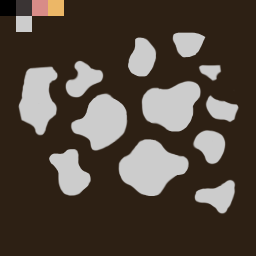<figcaption>
Dark cow texture
</figcaption></figure>

 

<figure><figcaption>
Cow texture applied to the unwrapped cow model
</figcaption></figure>

Same principle can be applied to models that have too fine details to be modeled yet not enough to create visual noise. Such as clothes.

<figure>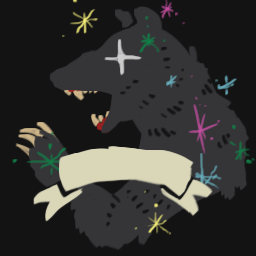<figcaption>
BikerJacketBears.png texture used (256x256)
</figcaption></figure>

 

<figure>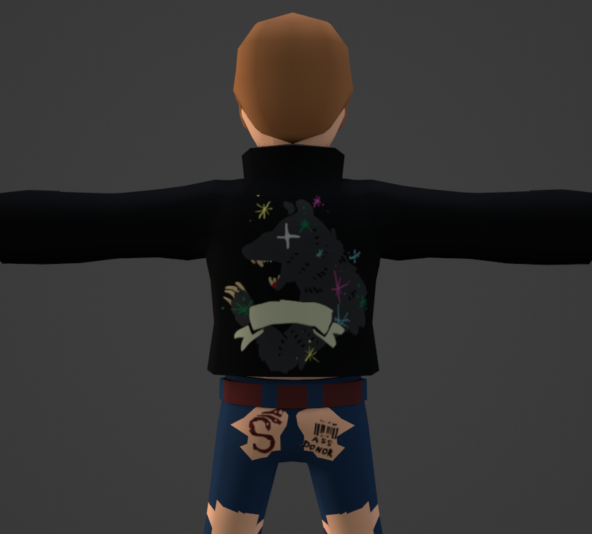<figcaption>
A leather coat with a logo (tattoo would be explained later)
</figcaption></figure>

 

<figure><figcaption>
BikerJacketBears.png unwrapped 
</figcaption></figure>

 

<figure>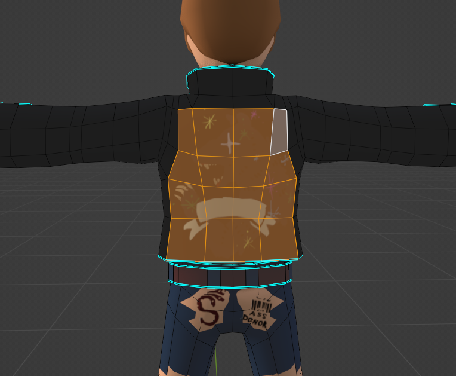<figcaption>
The exact model part the texture is applied to
</figcaption></figure>

Complex text or symbols can use a transparent texture and placed on a model like tattoos or floor decals.

<figure>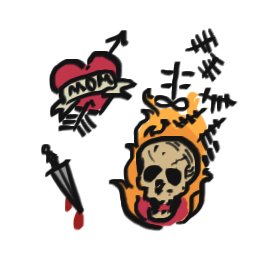<figcaption></figcaption></figure>

 

<figure>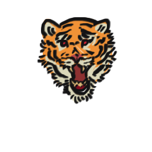<figcaption></figcaption></figure>

 

<figure>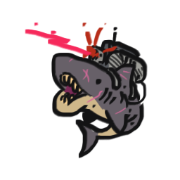<figcaption></figcaption></figure>

 

<figure><figcaption></figcaption></figure>

<figure><figcaption></figcaption></figure>

 

<figure>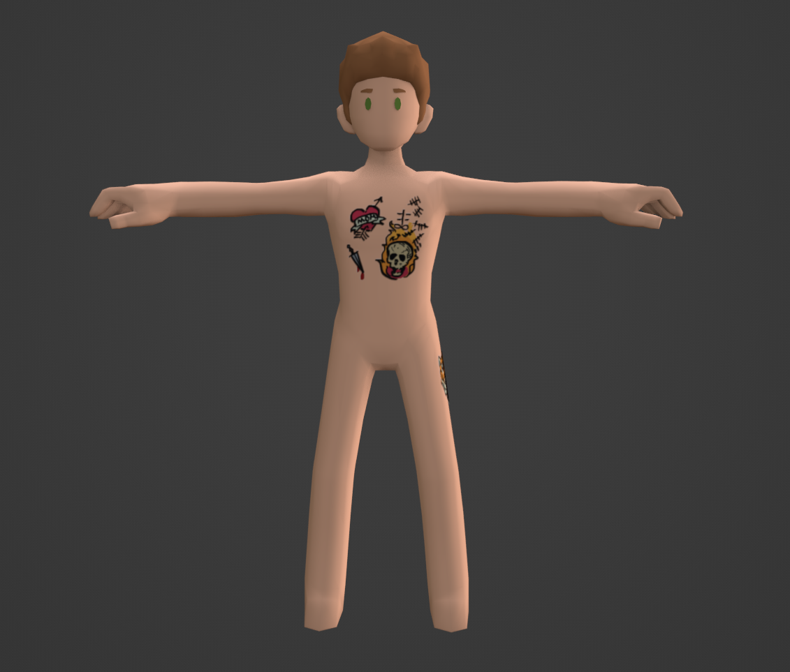<figcaption></figcaption></figure>

 

<figure>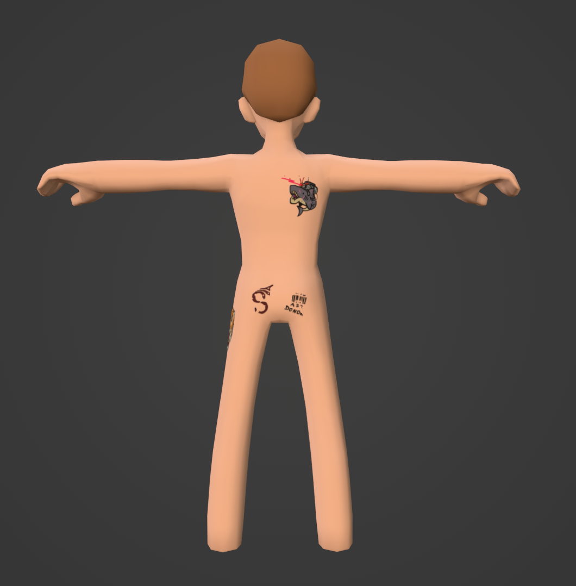<figcaption></figcaption></figure>

Some models can use several texture variants, like cows from the example above. To make the creation of such variants easier, one might create a template to guide others, who might take interest in creating more in the future.

<figure><figcaption>
A fully textured bed blanket
</figcaption></figure>

 

<figure>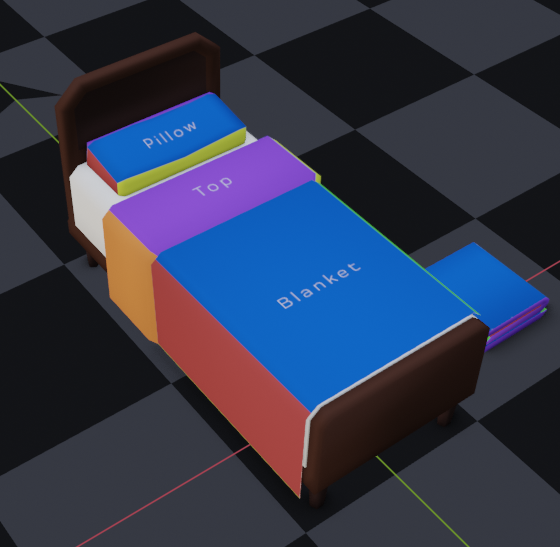<figcaption>
A template applied to the model
</figcaption></figure>

 

<figure>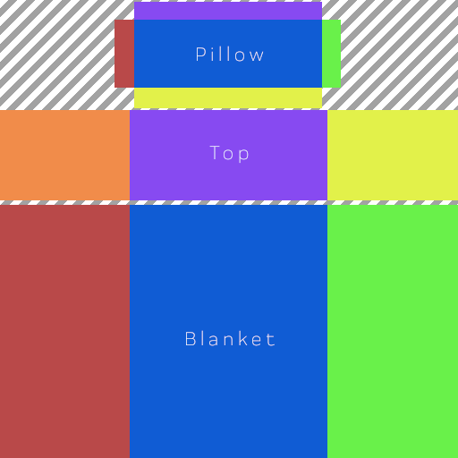<figcaption>
A template file Blanket.png (512x512)
</figcaption></figure>

Yet another way the textures are utilized are skyboxes. It is a cube with textures (4000x3000) on its inner faces, used to simulate the sky or similar backdrop around a three-dimensional space. Ours mostly used just for that: space backdrop. But there’s some creativity in creating a skybox for a holodeck (Those are in PNG, 4096x3072):

<figure><figcaption>
A more realistic nebula skybox texture used as a backdrop for the real station
</figcaption></figure>

<figure><figcaption>
A more cartoonish-looking space backdrop used for a holodeck “space” setting
</figcaption></figure>

 

<figure><figcaption>
A more cartoonish-looking space backdrop used for a holodeck “snow” setting
</figcaption></figure>

