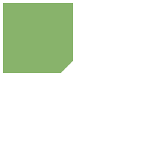
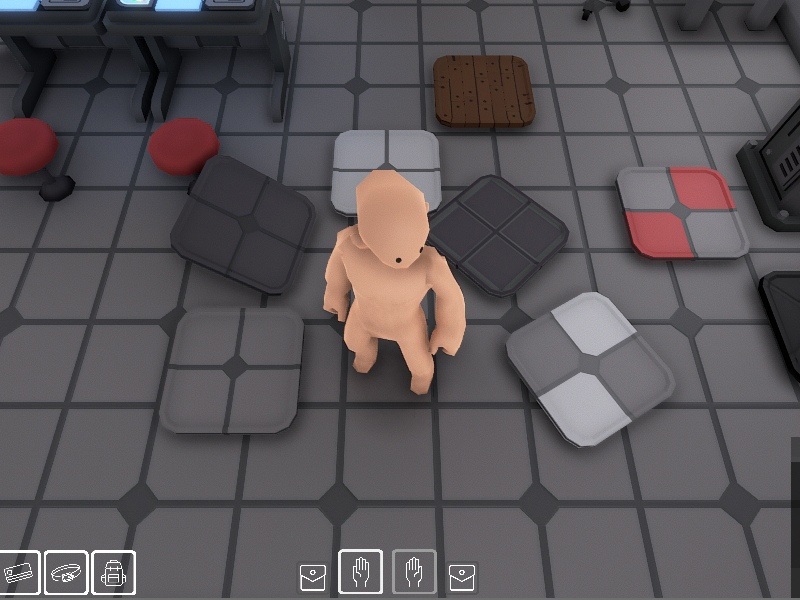
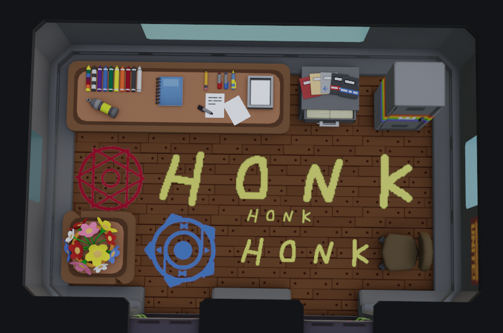

# Decals

### Decals

Decal is a texture/image overlaid on top of models. It’s mostly used to simulate bullet holes, cracks, spills or footprints.

It is advised that the decals are made of one or several images overlaid on top of each other, in order to be colored separately to simulate the material of the damaged object or material of the substance on top of the object. The colorable image layers must be white in order for Unity to add color procedurally.&#x20;

<figure><figcaption>
Splatter examples. These can be colored by unity to look like blood, oil, drink, paint or any other substance of color. 
</figcaption></figure>

When it comes to transport or robots or any other object that uses tracks, the trail left by those tracks is supposed to be composed of a single fragment, meant to be repeatedly placed on the floor with every track movement.

<figure><figcaption>
Separate tire marks
</figcaption></figure>

 

<figure><figcaption>
Tire marks forming a trail
</figcaption></figure>

That is supposed to function similarly as a photoshop brush to “paint” continuous tracks on the floor along an object’s path.

Other uses for decals are overlays - decals applied to structures, for example, overlaid over the floor or walls.&#x20;

<figure><figcaption>
An example of such a thing: the green part of the floor on the left is not a completely different model, but rather a standard floor time with a green part in the middle placed onto it. 
</figcaption></figure>

 

<figure><figcaption>
 TileOverlayGreen.png 256x256)
</figcaption></figure>

 

<figure><figcaption>
The floor tile item, which is UV unwrapped in a way to use the floor tile textures we already have
</figcaption></figure>

One texture might be used for several different items, if it is convenient. Take a look at the floor tile above as an example. Note: Floor tile textures will be rendered from 3d models so we can also render normal maps.

<figure><figcaption>
Warning lines
</figcaption></figure>

 

<figure><figcaption>
Runes and graffiti
</figcaption></figure>

