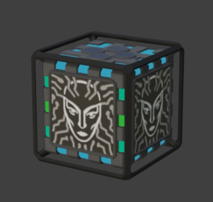
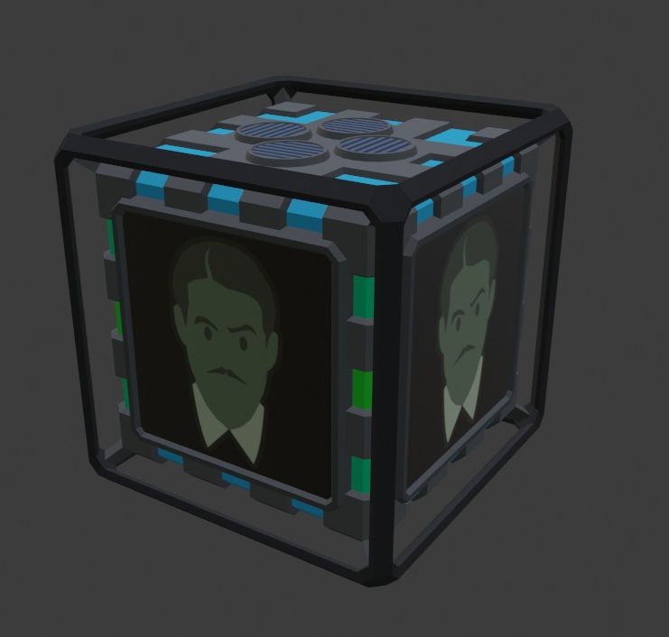

# Screens

### Screens

SS3D has a number of computers and terminals equipped with screens. By general consensus, their contents should be made in the similar style: flat-colored vector graphics.

<figure><figcaption>
Standard terminal with 4 different animations applied
</figcaption></figure>

In order to be animated, a texture animation should be converted into .mp4 in a resolution enough to fit the model’s screen. For regular consoles (pictured above) it’s 640px X 640px. But do note that the console’s screen is somewhat rectangular so the very top and bottom of the texture will be cut off. AI cores also have a place for textures, allowing some creative freedom (640px X 640px for these as well).

<figure><figcaption>
Pictured: AI cores emotive (various)
</figcaption></figure>

 

<figure><figcaption>
Standard core (SHODAN)
</figcaption></figure>

 

<figure><figcaption>
Corporate core (Mr. House)
</figcaption></figure>

If the image is made after (or based on) a humanoid person, it should resemble the style of the humanoid model. The same principle is used for ID cards in their menus (see UI elements above).
