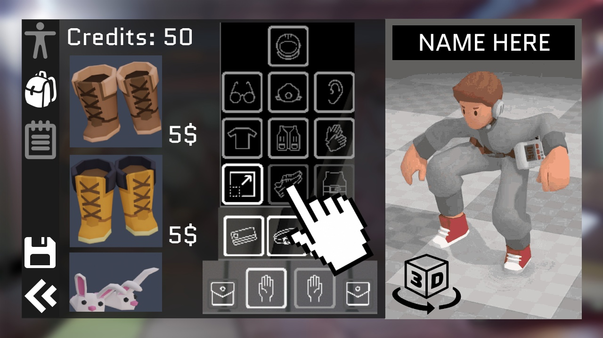
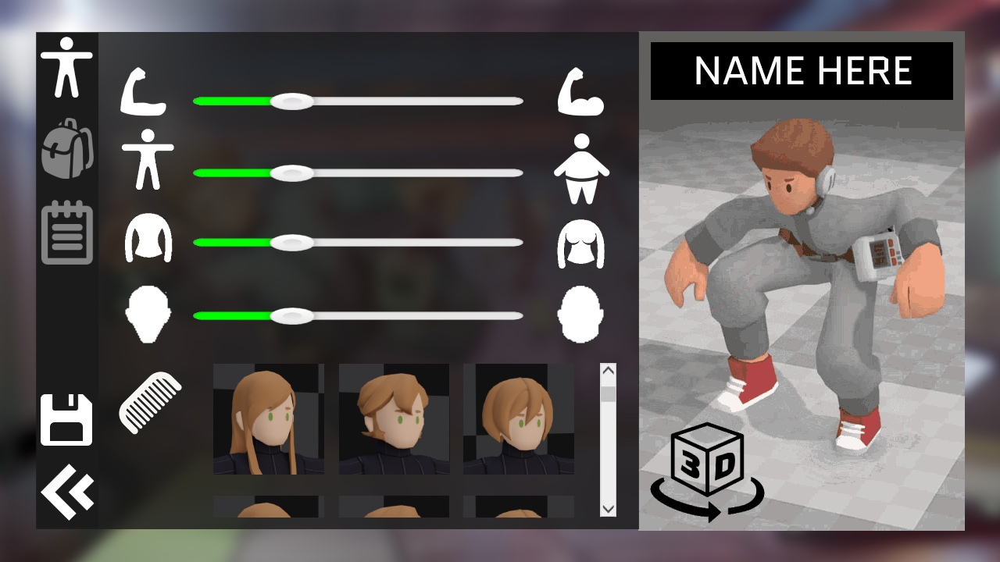

# Icons

## Custom Icons&#x20;

Icons, used in the UI, should be consistent in the style of the rest of the UI: simple, descriptive and stylized. One of the examples of using the Icons in the UI is the interaction wheel pictured below:

<figure><figcaption>
Interaction wheel for a radio with 3 interaction options
</figcaption></figure>

Every Icon is white (we can change its color in Unity), smooth and readable on the dark background (or on a more transparent/light part of the wheel, if the option is selected) and descriptive, clearly indicating the action it represents. (White icons also have the benefit of easily changing their color in the editor.)

In case the action cannot be fully depicted by a simple icon, the priority should be simplicity and readability over descriptiveness.&#x20;

<figure><figcaption>
For example: out of two icons below the better icon to use is the one on the right, as the one on the left is overcomplicated. 
</figcaption></figure>

Take the size of the icon into consideration: most of the icons would be placed into relatively small menus and still should be clearly seen. The “overcomplicated” icon above in that case might also create visual noise when scaled down, due to the distance between the wall and the tool parts of the icon.

Additional, extremely lazy, but hopefully useful mockups for the interface with icons below:

<figure><figcaption>
Character loadout menu
</figcaption></figure>

 

<figure><figcaption>
Character creation menu
</figcaption></figure>

While the general composition of the mockup is not representative of what we aim for, do notice that most of these icons are readable even when zoomed out.

Do avoid pixelization and aliasing of the edges of icons. And generally, avoiding small details and unevenness is a good idea. The problem is, small icons don't scale up well, and large icons don't scale down well. There is a method called “Improved Alpha-Tested Magnification”, outlined [here](https://steamcdn-a.akamaihd.net/apps/valve/2007/SIGGRAPH2007\_AlphaTestedMagnification.pdf). But until it’s implemented, best to have the icons in a quality that would allow them to be vectorized automatically via any convenient program or service.

Stylization in these icons involves emphasizing certain parts of an object. Just like with modeling objects for the game, the goal is just to make a caricature of the real thing, not emulating an object itself, so feel free to take creative liberties, as long as the previous guidelines apply.

For slots (as seen in the loadout menu example) the icons located inside should be half-transparent to not clash with the items placed into that slot. Alternatively, the icon inside should turn transparent the moment that slot is occupied and return to the full opacity the moment it's vacant once again.

## Rendered Icons

As for rendered icons, they should be recognizable, fit into the inventory square and visible on both light and dark background. One of the options to accomplish it is to give an outline to the rendered item via Unity instruments:

<figure><figcaption>
Outline types on a colored object
</figcaption></figure>

Both options have their advantages. However, as most of the inventory slots are also located in the block that is dark and semi-transparent, right next to the white UI icons, it would make sense to choose the bright outline. Not to mention that there are more colored and dark items then bright ones, and a dark outline on the dark object does not help it's readability:

<figure><figcaption>
Outline types on a darker object
</figcaption></figure>

<figure><figcaption>
Outline types on a lighter object
</figcaption></figure>
