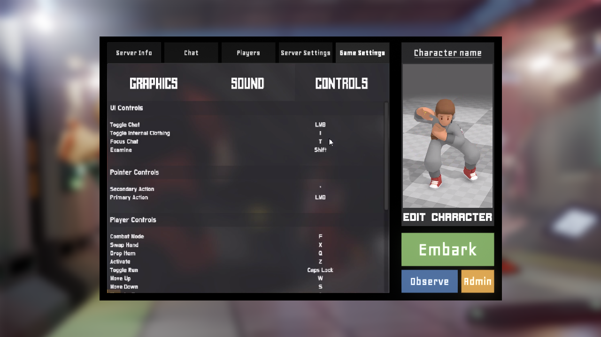
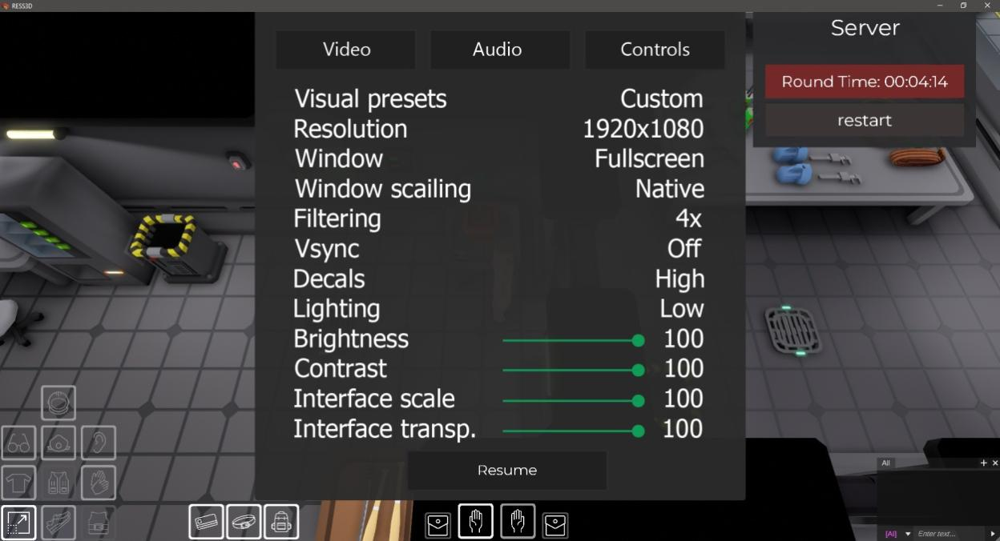

# Menu

This is a page for menu concepts in terms of info and element allocation, please ignore wrong backgrounds, fonts and/or icons.

## Connection Menu

Connection menu is where the player pastes the server name or adress or hosts their own server:

<figure><figcaption>
Connection menu
</figcaption></figure>

## Starting Menu

Starting menu should be the one to follow the connection menu and the one that actually sends the player into the game as a set character or as a spectator. It also serves several other purposes:

Provides a list of servers or information about a selected server:

<figure><figcaption>
Server info menu
</figcaption></figure>

Provides a list of players and occupied roles:

<figure><figcaption>
Server players menu
</figcaption></figure>

Allows changing the game settings (video and audio settings the same as in the [#in-game-settings](menu.md#in-game-settings "mention")):

<figure><figcaption>
Game settings tab
</figcaption></figure>

And allows editing character at any point prior to embarking.

## Edit Character

This menu is made to set up player's character. This requires several other systems, like shape keys, clothing and jobs.

The character appearance is the menu where the player decides the character's shape, mass, hair, skin color, special features and other things:

<figure><figcaption>
Character appearance screen
</figcaption></figure>

Character loadout is the menu where equipment like clothes, tools and cosmetics are assigned to the character:

<figure><figcaption>
Character loadout screen
</figcaption></figure>

Job selection screen is where the player sets their preferences for their role on the station:&#x20;

<figure><figcaption>
Concept for job selection menu
</figcaption></figure>

<figure><figcaption>
Early concept of the role selection window. While it has several issues in its UX, do note the cartoonish vector design used in its objects. Discontinued as of 2023.
</figcaption></figure>

## In-game Settings&#x20;

This is the menu to change the setting in the middle of the round or to AFK in if needed.

It has the regular settings one would expect form the 3D game, such as graphical tweaks:

<figure><figcaption></figcaption></figure>

Sound volume levels and sound-related settings:

<figure><figcaption>
A concept for the audio settings menu
</figcaption></figure>

And the same controls menu page from the [#starting-menu](menu.md#starting-menu "mention").&#x20;

There are other types of menus that are actually taking part in the gameplay directly, such as crafting menus or console menus. Most of them are either a part of the player's initial interface or a specifically set up type of window with unique interactable elements.&#x20;
