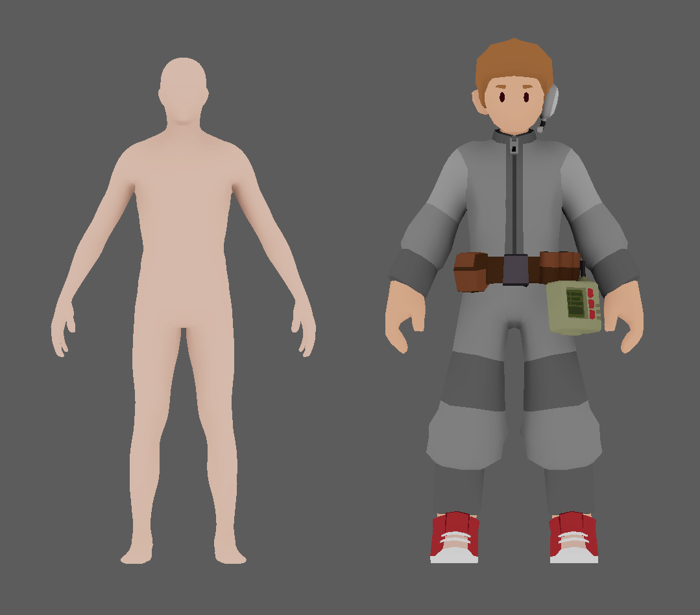

# Shape

### Proportions

This section is immensely important to maintain consistency with our art style. Follow what comes after this sentence like gospel: Stylization involves emphasizing the defining parts of an object. When modeling something that exists in reality don't try to accurately reproduce it, even with reference the goal is just to make a caricature of the real thing. Another thing to keep in mind is that the world the characters inhabit is vastly different from the one that we do. When your fingers are thrice as thick as those of a human, the design language of everything you interact with changes dramatically to accommodate.&#x20;

Just because you modeled that fancy AK-47 as accurately as you could, it can't be usable in game simply because the characters wouldn't even be able to comfortably hold it. Its stock would be too long and makes holding it awkward, and the trigger guard wouldn't even let a finger through. objects that would fit comfortably in our hands like a multitool, would be miniscule and hard to use for the game characters if they got their hands on it. If a single word could be used to describe the design language of everything in SS3D, it would be 'chunky'. Thick edges, large buttons, etc. In the image below, you can see just how different the character looks like compared to an anatomically correct human. Ensure you take this into consideration when making the assets.

## Shape

Remember that items will be seen from pretty far away, so zoom out early and often, and always look at your work from all angles.&#x20;

### Detail

Focus on details that contribute to the silhouette. A gun barrel or tube doesn’t need to be hollow, it’s enough if the end cap is a darker color or just solid black.&#x20;

If certain details are important but too small to be noticeable, make them bigger.&#x20;

As a poor example, you don’t need 101 keys to model a keyboard the same way you wouldn’t draw every brick in a wall, just enough so that it’s readable as one, and big enough that it can be seen from far away. Don’t get attached to close shots of your model.&#x20;

Too fine or complex detail might just become noise when viewed from the proper distance, so zoom out often.

### Polycount

The current year is ~~2018~~ and modern computers are capable of rendering millions of triangles per frame.

Low poly is largely a stylistic choice, but SS13 is a sandbox game and it’s not unreasonable to expect that hundreds of objects could be on screen at the same time.&#x20;

It’s also about consistency— objects that are very polygon-dense will look out of place next to their low-poly friends.

### How many sides should my cylinder/sphere have?

Enough that it looks like a cylinder from camera distance. Larger objects have more sides, as well as objects that should have glossy highlights like the cryotube on the right.&#x20;

It's difficult to correct this later in the modeling process. Remember to turn on smooth shading by selecting all faces then using Ctrl-F > ShadeSmooth. Select a matcap from the Shading panel on the right, regular Blender lighting is distractingly shiny and bumpy.

Matcaps don’t affect the material whatsoever, it’s just a preview within Blender.

### Bevels

Bevels are very useful in hard surface modeling since they catch and reflect light, highlighting the edges of an object.&#x20;

SS3D though has a rough clay look, with left smoothness as a special eect for things that really need it so bevels are not that important and mostly optional. Do add them when your object has large surfaces, like a fridge, which otherwise would look like a tall box.

Small objects or small parts of larger objects don’t need them, since it would have little impact on the silhouette.

#### Bevel Modifier

Alternatively use the Bevel Modifier in combination with bevel weights, which you can set individually for edges in the model.

It’s easier to tweak but I recommend applying the modifier after you’re done with it.

