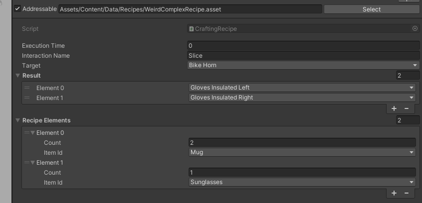

# Makeshift, simple Crafting

Makeshift Crafting is a way for characters to make Makeshift weapons, Clothing, Food and other various items without the need of using a specific workstation (such as a Workbench, Stove, Microwave, Fabricator, Forge or other).

## Crafting Recipes

Crafting recipes consists of the following elements :

* A target item, that is an item that needs to be interacted with to produce other items. A wheel of cheese can be a target, to produce melted cheese, or two half wheel of cheese.
* A list of needed ingredients, their number, as well as if they should be held in hand. nothing is lost, nothing is created, everything is transformed.
* A specific interaction. You'll need to interact with the target item in a specific way to craft something out of it. If you want two half wheel of cheese, you'll need to slice it in half. Multiple tools can be the source of the needed interaction.
* A list of resulting items. All the items produced by the crafting !
* Duration of the crafting interaction. It takes time to craft anything !

<figure><figcaption><p>A recipe, not much sense this one but you get the idea.</p></figcaption></figure>

This list should contain thename and quantities of various items and materials used for crafting, name of interactions , as well as the names and quantities of the resulting items.

Example of the content of the said list

(this and later formatting examples are for explanation purposes only):

```
{
  "type": "recipe",
  "result": "wired_pole",
  "time": "2 s",
  "interaction": "Place", // Wires can be the source of interaction.
  "component": [[ "metal_rod", 1 ], ["wires", 5, inhand = true]]
},
{
  "type": "recipe",
  "result": "powered_wired_pole",
  "time": "5 s",
  "interaction": "Place", //Battery can be the source of interaction.
  "component": [[ "wired_pole", 1 ], [battery, 1, inhand = true]]
},
{
  "type": "recipe",
  "result": "powered_wired_pole_igniter",
  "time": "5 s",
  "interaction": "Place", //Igniter can be the source of interaction.
  "component": [[ "powered_wired_pole", 1 ], ["igniter" , 1, inhand = true] ]
},
{
  "type": "recipe",
  "result": "makeshift_stunprod",
  "time": "3 s",
  "interaction": "Screw", // Screwdriver can be the source of interaction.
  "component": [[ "powered_wired_pole_igniter", 1 ]]
}
```

The first recipe makes a wired pole by adding 5 wires to a metal rod one by one

The second adds a battery to the wired pole

The third one adds an igniter to the powered wired pole

The fourth one uses (but not adds) a screwdriver on the powered wired pole with igniter to make a makeshift stunprod.

## Expected behaviour

**Pie example:**

```
{
  "type": "recipe",
  "result": "empty_pie",
  "time": "5 s",
  "interaction": "Place", //Dough can be the source of interaction.
  "component": [[ "empty_pie_tin", 1 ], ["dough", 1, inhand = true] ]
},
{
  "type": "recipe",
  "result": "uncooked_apple_pie",
  "time": "5 s",
  "interaction": "Place", //Apple slices can be the source of interaction.
  "component": [ [ [ "empty_pie", 1 ], [ "apple_slices", 3, inhand = true] ] ]
},
```

This is how the recipe is expected to be executed by the player:

1. Player takes the dough in hand. Player walks near the empty pie tin (or holds it in the other hand) and performs a primary interaction on it with the filled hand. Result: dough is deleted, hand becomes empty, empty pie tin is replaced with an empty pie, placed in the same location.
2. Player takes the apple slices in hand. Player walks near the empty pie (or holds it in the other hand) and performs a primary interaction on it with the filled hand. Result: apple slices are deleted, hand becomes empty, empty pie is replaced with a pie crust, filled to 1/3 with apple slices, placed in the same location.
3. Player takes the apple slices in hand. Player walks near the partially filled pie (or holds it in the other hand) and performs a primary interaction on it with the filled hand. Result: apple slices are deleted, hand becomes empty, empty pie is replaced with a pie crust, filled to 2/3 with apple slices, placed in the same location.
4. Player takes the apple slices in hand. Player walks near the almost filled pie (or holds it in the other hand) and performs a primary interaction on it with the filled hand. Result: apple slices are deleted, hand becomes empty, empty pie is replaced with an uncooked apple pie, placed in the same location.

Every action performed during makeshift crafting takes set time, length of which might be increased, depending on the condition of the character’s hands (see Medical design document (WIP/TBD))

For every intermediate stage of pie there should exist a separate model, visually representing different stages of the item or it’s components, where it’s appropriate and makes sense.

To lower the amount of modelling work, these three options were proposed for the pie as an example.

1. Add the whole model of the ingredient and place it into the model
2. Add the lowpoly “chunks” that represent parts of an ingredient and place it as a layer into the model
3. Add a single model representing the amount of added ingredients and increase its volume with every added ingredient (optionally color it using unity)

These are represented in the rows on the picture below:

<figure><figcaption></figcaption></figure>

## **Pipegin example**

```
{
  "type": "recipe",
  "result": "pipegun_base_loose",
  "time": "10 s",
  "interaction": "Place", // Rifle_Stock can be the source
  "component":  [ [ "Rifle_Stock", 1, inhand = true ],  [Modular_Receiver,1] ]
},
{
  "type": "recipe",
  "result": "pipegun_base",
  "time": "10 s",
  "interaction": "Screw",
  "component": [ [ "pipegun_base_loose", 1 ] ]
},
{
  "type": "recipe",
  "result": "pipegun_unfinished",
  "time": "10 s",
  "interaction": "Place", // Disposal pipe can be the source
  "component": [ [ "pipegun_base", 1 ], ["Disposal Pipe", 1, inhand = "true"] ]
},
{
  "type": "recipe",
  "result": "pipegun",
  "time": "10 s",
  "interaction": "Place", // Duct_tape can be the source,
  "component":  [ [ "pipegun_unfinished", 1 ], [ "Duct_tape", 1, inhand = true ] ] 
},
```

This set of recipes contains non consumable tools. This is how the recipe is expected to be executed by the player:

1. Player takes the Rifle Stock in hand. Player walks near the Modular Receiver (or holds it in the other hand) and performs a primary interaction on it with the filled hand. Result: Stock is deleted, hand becomes empty, Reciever is replaced with a Reciever, loosely connected to the Stock, placed in the same location.
2. Player takes the Screwdriver in hand. Player walks near the Result of the previous craft (or holds it in the other hand) and performs a primary interaction on it with the filled hand. Result: Screwdriver stays as is (alternatively, it’s durability lowered after usage), Result of the previous craft is replaced with a Makeshift firearm base, placed in the same location.
3. Player takes the Disposal Pipe in hand. Player walks near the Result of the previous craft (or holds it in the other hand) and performs a primary interaction on it with the filled hand. Result: Disposal Pipe is deleted, hand becomes empty, Result of the previous craft is replaced with an Unfinished pipegun, placed in the same location.
4. Player takes a Duct tape roll or a Package wrapper in hand. Player walks near the Result of the previous craft (or holds it in the other hand) and performs a primary interaction on it with the filled hand. Result: adhesive tool stays in hand, expanding some of it’s resource (kind of like welding torch loses some of it’s fuel after every use), Result of the previous craft is replaced with a pipegun, placed in the same location.

As seen here, tools are not expendable, but they might take a hit in durability and, if applicable, lose some of their resources.

## Work with reagents

```
{
  "type": "recipe",
  "result": "Bowl_of_wet_uncooked_rice",
  "time": "10 s",
  "tool": [ { “glass”:["water"], 1,  "purity": [90, 100]} ],
  "component": [ [ [ "Bowl_of_uncooked_rice", 1 ] ] ]
},
```

The last recipe should result in creation of a bowl of wet uncooked rice.

This recipe deals with reagents. This is how the recipe is expected to be executed by the player:

Player takes a glass filled with water in hand. Player walks near the Bowl of uncooked rice (or holds it in the other hand) and performs a primary interaction on it with the filled hand. Result: glass stays in hand, expanding all of it’s contents, Bowl of uncooked rice is replaced with a Bowl of wet uncooked rice, placed in the same location.


Is there any allowance for a deviation from the recipe when using reagents? Is the Bowl of uncooked rice still wet if the glass contains 99% water and 1% anything else?

