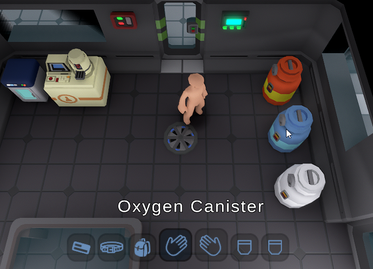
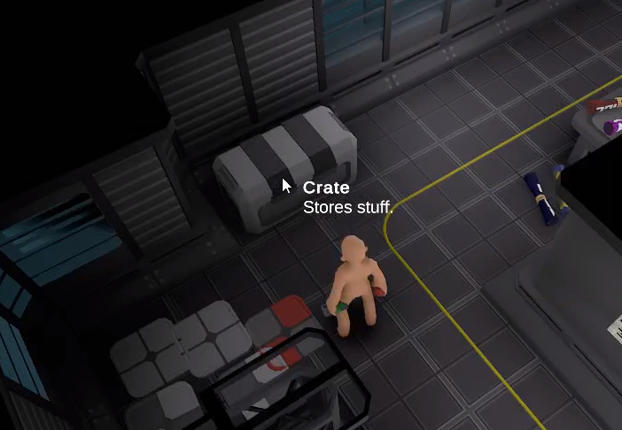
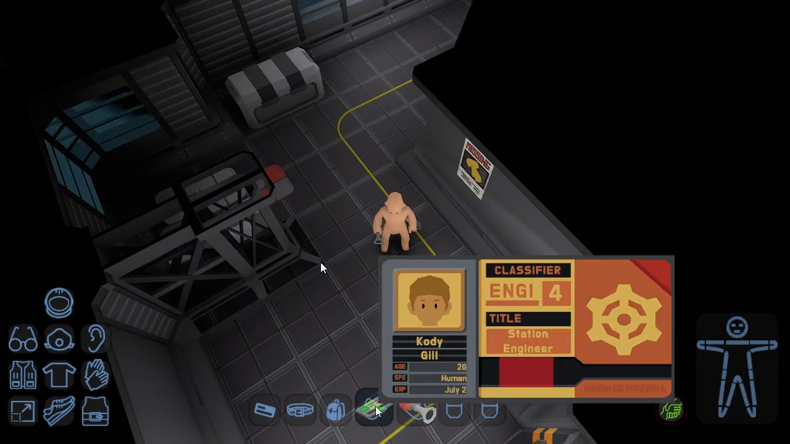

# 🔍 Examine

Players should be able to examine the things that are being visually displayed to them. This is vital due to simplistic [art style](../readme/art-style.md) of the game and the amount of unique qualities of many objects.

## Basic Examine 

AKA "Hover Examine", this basic form of examine happens continuously to display the name of the object your cursor is hovering over.

<figure><figcaption>
Basic (hover) examine.
</figcaption></figure>

## Detailed Examine 

Detailed examining is self explanatory in that it not only displays the object's name but also more details about the object like a description, inventory, custom ui, etc. (if it has those). It has to be activated by the player via holding a key (see [Controls](controls.md)).

<figure><figcaption>
Object with short description.
</figcaption></figure>

We can also add more detail to the description of an item the longer someone is examining it (while close). So if you examine someone running past you just get their skin, hair color, and some clothing yet miss their name for example.

### Custom UI

The custom UIs on certain objects can provide more information than to the player than just a name and description. Below you can see a character's ID card with his name, age, occupation, and even a photo.

<figure><figcaption>
Object with a custom UI.
</figcaption></figure>

Custom examine UIs are distance-sensitive though. Meaning they only show up if you are within a certain distance, otherwise you will only see a basic name & description or even just a name.

Some objects may show their inventory contents even, like characters for example.

<figure><figcaption>
Detailed examining a character.
</figcaption></figure>
