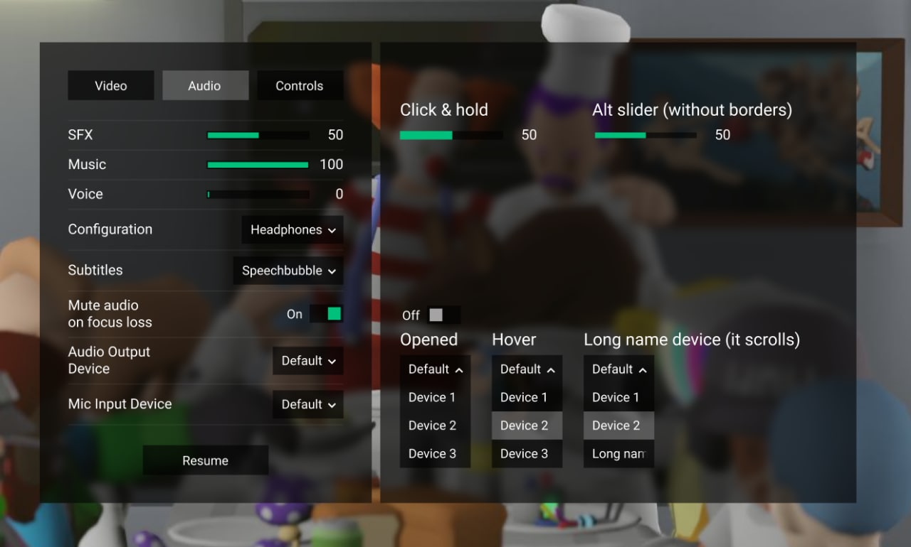

# In-game Settings

This is the menu to change the setting in the middle of the round or to AFK in if needed.

It has the regular settings one would expect form the 3D game, such as graphical tweaks:

<figure><figcaption></figcaption></figure>

Sound volume levels and sound-related settings:

<figure><figcaption></figcaption></figure>

Another, slightly more styled design:

<figure><figcaption></figcaption></figure>

And the controls menu:

<figure><figcaption></figcaption></figure>
