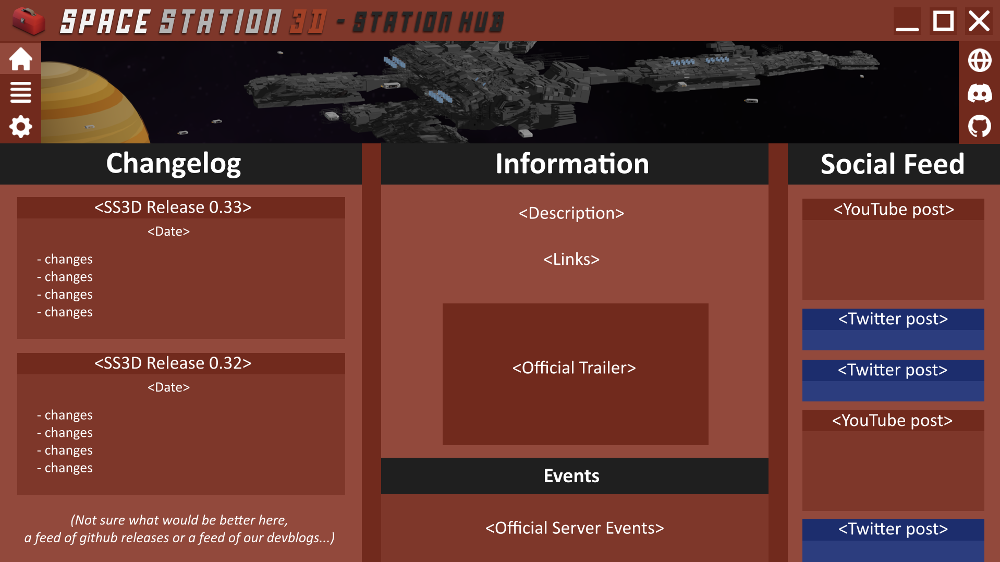
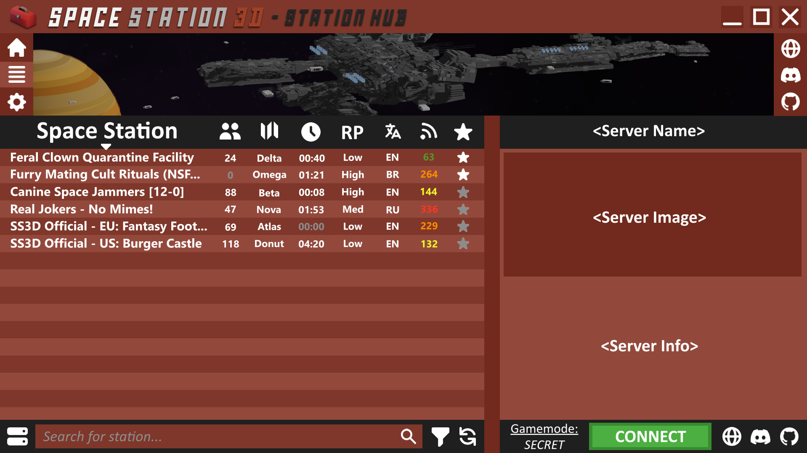
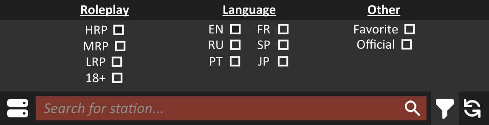
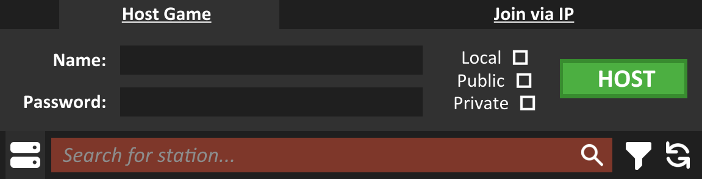
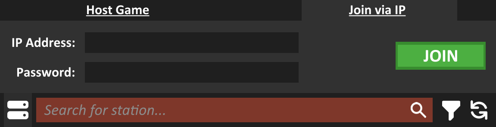
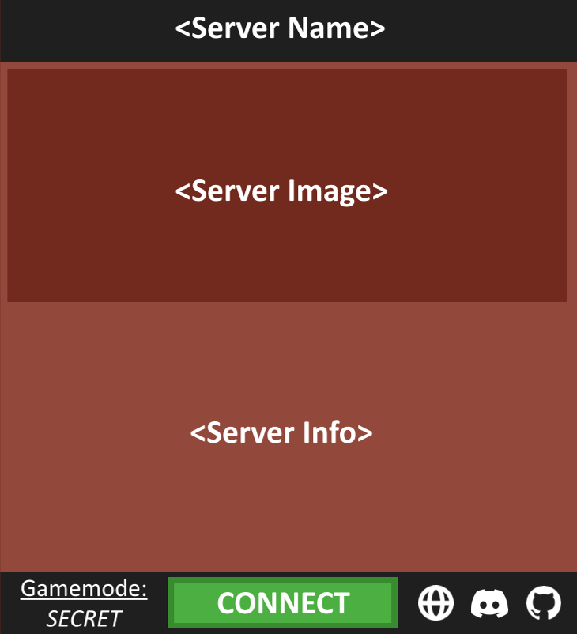
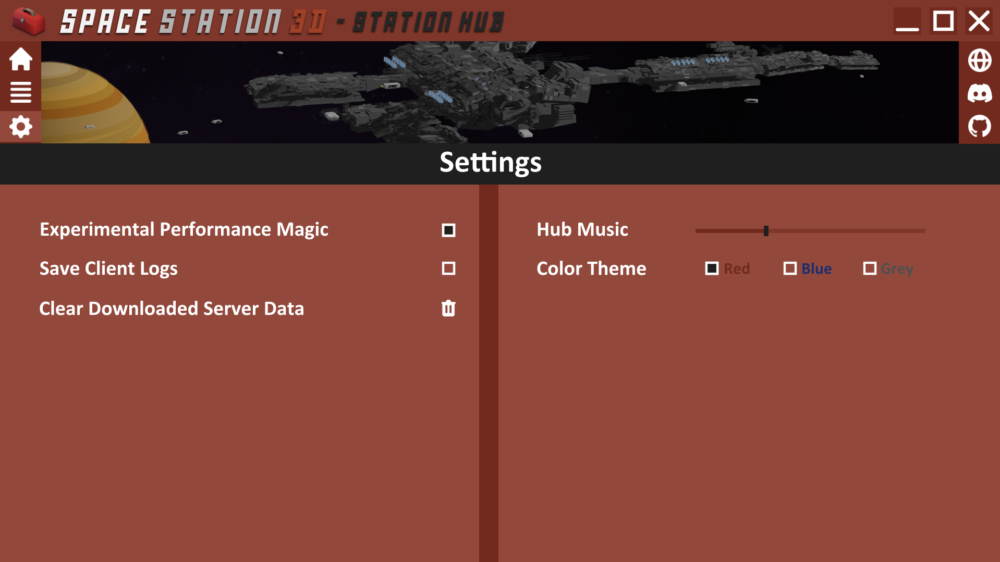
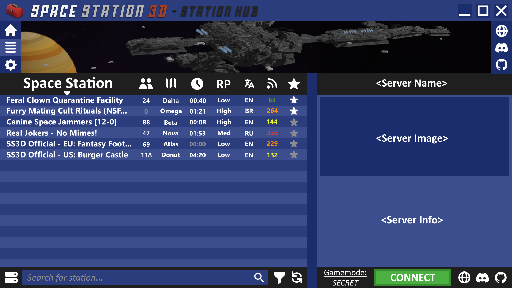
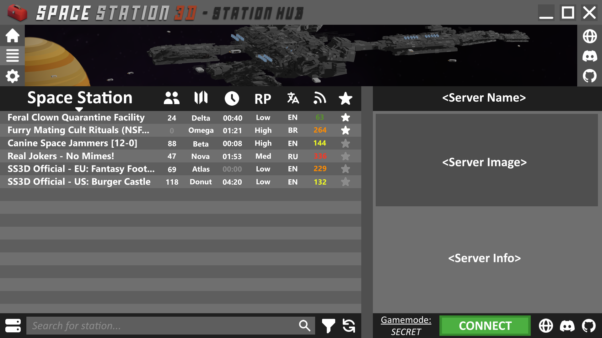

# Server Hub

The server hub is simply a 3 page menu with the primary purpose of displaying a list of servers for a user to browse and join through.

### Header

<figure><figcaption></figcaption></figure>

The window title bar is pretty self explanatory; there's an icon and title of the left, and a minimize, maximize, and exit button on the right.

Then below that, we have 3 buttons on the left and 3 on the right. The 3 on the left are for the 3 pages as mentioned above; Home, Servers, Settings (the Servers button is highlighted because that page is the active one). The 3 on the right are SS3D links; Website, Discord, GitHub.

## Home Page

<figure><figcaption></figcaption></figure>

The Home page is the first page and mostly provides information.

(_There should also be scroll bars on this page but did not get included in the image._)

### Changelog

The changelog provides a feed of recent changes in the game.

This will be connect to either our github releases or the devblogs on our website.

### Information

A description of the game. Maybe a brief history, or witting quote, or welcome message.

Some links to our official platforms.

### Events

A small bulletin of current/upcoming events on official ss3d servers.

### Social Feed

A feed connected to our various social media accounts; like YouTube and Twitter.

## Servers Page

<figure><figcaption></figcaption></figure>

The Servers page is the primary page users will spend time on, as they browse and read about servers.

### Server List

The server list is the large window on the left. Not only server name but the list provides server info on; crew count, map, round time, roleplay level, language, ping, and favorite star. The list can be sorted by any of these sections.

In the image above the server list is currently sorted by server name, hence the little arrow beneath "Space Station", so the list has the names of servers sorted alphabetically top-to-bottom... but the Favorite Star has higher priority over the sorting arrow so both favored servers are forced to the top. though both sections (favored & unfavored) are still being sorted alphabetically, just separately.

When hovering over or selecting a server it will turn color.

(_There should also be scroll bars on this page but did not get included in the image._)

#### Server Name

Server names may get long, if so they will be cut off after a certain point with "...". Though when hovering over the name it will begin slowly scrolling right-to-left.

#### Crew Count

One thing to note is that if the server's population (crew count) is 0, the number will turn another color (grey). Also, if a server has set a max population in their server settings, and that max has been reached, the color of the number will change (black maybe?).

#### Map

Was thinking these _could_ be color-coded in some way.... or not...

#### Round Time

When the round is not started (00:00) the time turns grey.

#### Roleplay Level

Self explanatory.

#### Language

Self explanatory. (Yes, I realize "BR" - Brazilian is really a language but it was late when I was making this.

#### Ping

Color-coded.

<100 = green, 100-199 = yellow, 200-299 = orange, >299 = red

#### Favorite

Overrides the Server List sorting arrow (forces favored servers to the top). Favored servers basically become a second list that abides by the sorting arrow as well, but simply exists the non-favored server list.

### Server List Extended

At the bottom of the Server List, exists some additional buttons and tools.

#### Search Bar

<figure><figcaption></figcaption></figure>

The search bar works like any other. The grey text vanishes when you start typing in the box. The magnifying glass is the send button. The revolving arrows on the far right refresh the Server List above. Next to it is the Server List Filter (see below). And on the far left is the Advanced Server Options (see below).

#### Server List Filter

<figure><figcaption></figcaption></figure>

The Server List Filter pops up a tab of options by which the user can filter the Server List by. The options stack together.

#### Advanced Server Options

<figure><figcaption></figcaption></figure>

<figure><figcaption></figcaption></figure>

The Advanced Server Options button also pops up a tab. This one has 2 sub-tabs; on the left (top image) is the Host tab, on the right (bottom image) is the Join tab.

The Host tab is used for hosting your own game. You can give your game (server) a name and a password. You then can select from 1 of 3 options:\
**Local**; keeps your game local and does not connect it to the web in any way.\
**Public**; connects your game to the web & hosts your game publicly on the SS3D Server Hub.\
**Private**; connects your game to the web but does NOT get shown on the Server Hub. Only way to connect to a private server is to join manually by inputting their IP (see below).

The Join tab is used for manually joining a server. This is used for joining servers that are private (not listed in the Server List). You must know their IP and if they have one, their password.

### Server Info

<figure><figcaption></figcaption></figure>

The Server Info section will be filled with content/info provided from the servers themselves. In the, their server name. Then an image, and finally some information about the server.

This section isn't concrete in design, and possibly the layout of this section could simply be in the hands of the servers themselves.

### Server Info Extended

Server Info Extended refers to the dark bar at the bottom of the the Server Info section. The left side displays the current gamemode set by the server. The middle has the obvious connect button. And the right side has 3 weblink buttons, similar to those in the Head of the Station Hub, but these are for the server's links rather than SS3D links. They are for website, discord, & github.

## Settings Page

<figure><figcaption></figcaption></figure>

The Settings page is the final page on the Server Hub. It's pretty self explanatory and filled with example settings. Though one of those examples is the idea of color themes for the hub...

### Color Themes

As seen in the example above, blue and grey options seem like they would fit well...

<figure><figcaption></figcaption></figure>

<figure><figcaption></figcaption></figure>

And maybe it would be nice to have something for the dark theme addicts... (ignore the poor photoshop color change on this one... though one thing about the below example that is really nice is the additional shadow/border on the header text).

<figure><figcaption></figcaption></figure>

Imo, it would be cool to have red, blue, & grey themes AND dark red, dark blue, & dark grey themes in the end.
