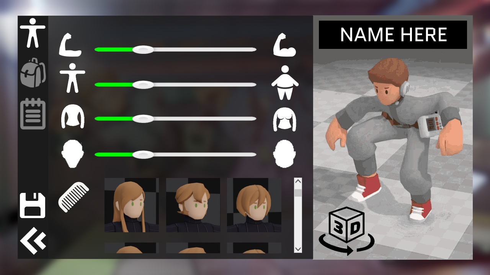
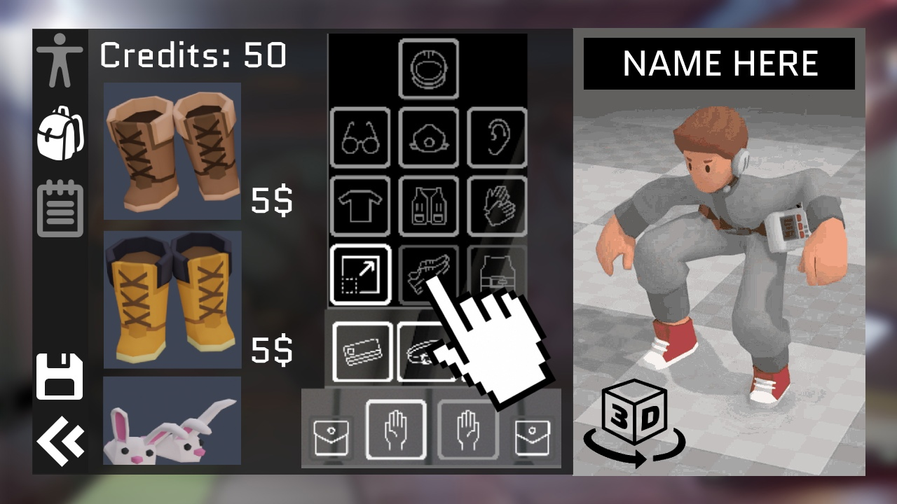
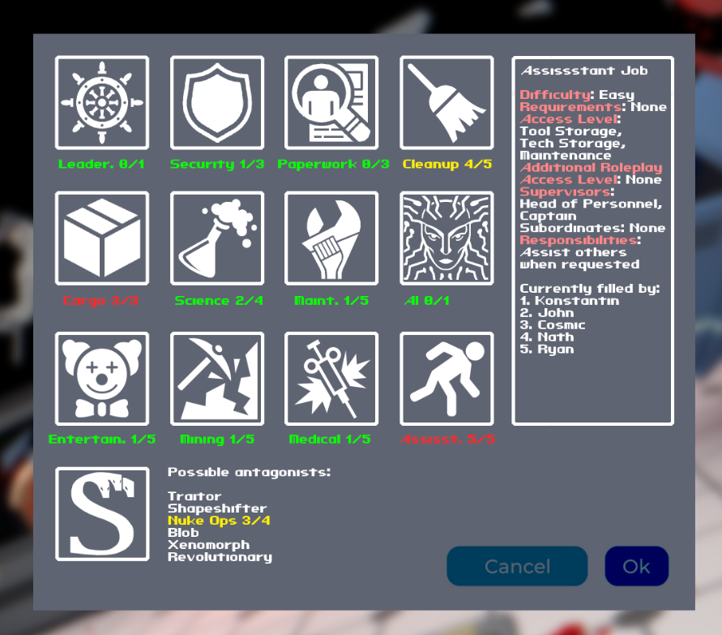

# Edit Character

This menu is made to set up player's character. This requires several other systems, like shape keys, clothing and jobs.

The character appearance is the menu where the player decides the character's shape, mass, hair, skin color, special features and other things:

<figure><figcaption>
Character appearance screen
</figcaption></figure>

Character loadout is the menu where equipment like clothes, tools and cosmetics are assigned to the character:

<figure><figcaption>
Character loadout screen
</figcaption></figure>

Job selection screen is where the player sets their preferences for their role on the station:

<figure><figcaption>
Concept for job selection menu
</figcaption></figure>
