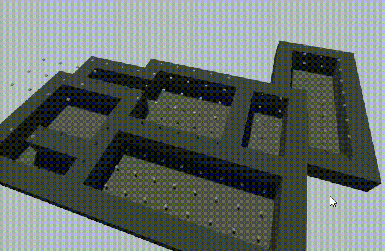
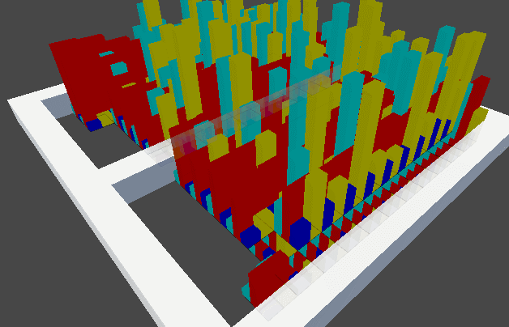

# ☁ Atmospherics

Due to the nature of the setting, **it’s important that the systems that allow for atmospheric simulation are powerful enough to simulate the presence of – or lack of – gasses in rooms.**

Gasses must be able to be transferred through a complex network of pipes, and must regulate pressure between rooms. For example, if a low pressure room is adjacent to a high pressure room, and the door between them is open, **air should flow from the high pressure room into the low pressure room, until pressure is equalized**. Ideally, this should cause wind that, if strong enough, should blow anything not buckled down in the direction of the airflow.

<figure><figcaption>
First steps for good atmos are progressing. The cubes are indicating pressure.
</figcaption></figure>

The gas in atmos is not as simple and abstract as it might seem at the first glance. Every gas in the atmospheric simulation should contribute in the overall simulation.

For example, releasing the flammable gas into the station's atmosphere should make it mix with the regular station air and expand throughout the whole station. Or, for another example, people regularily breathing should consume breathable air and exhale CO2, making the sustainable source of breathable air another important task for the Atmos Technitian role.

<figure><figcaption>
A representation of a mixture of gasses. The higher the box of a certain color, the more of the according gas is in that tile.
</figcaption></figure>
