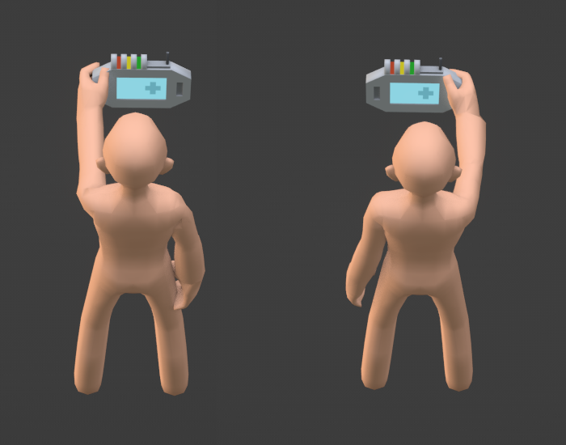
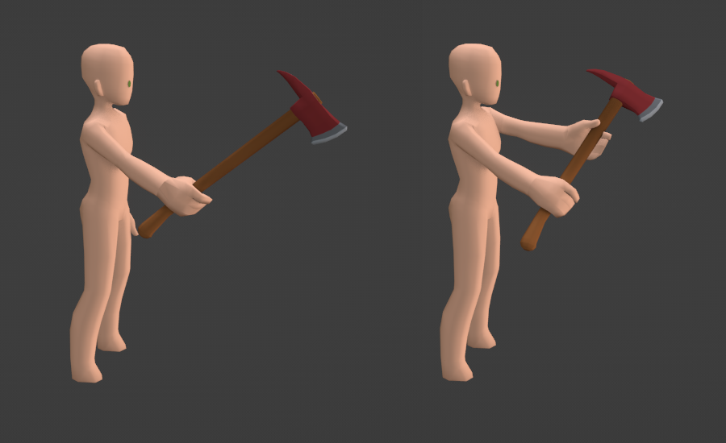

# 📌 Hold Positions

Hold Positions are the position on an item that a character holds it by. They are empty objects used to simply set a location and rotation. Link below is a video showing them in use on items in-game.

[https://ss3d.space/assets/img/posts/20.05.01/ItemOrientations.mp4](https://ss3d.space/assets/img/posts/20.05.01/ItemOrientations.mp4)

Some items may have more than one Hold Position. Different variables like object's shape, object's type, object's state, character's intent, character's species, character's hand, character's pose etc.. may effect how a item is held. This will be managed via different Hold Positions.

<figure><figcaption>
Different items may be held in different poses, resulting in different hold positions.
</figcaption></figure>

#### Examples:

<figure><figcaption>
Item with different Hold Positions for left hand and right hand.
</figcaption></figure>

<figure><figcaption>
Item with different Hold Positions for one-handed and two-handed wielding.
</figcaption></figure>

<figure><figcaption>
Item with different Hold Positions for help and harm intents.
</figcaption></figure>
