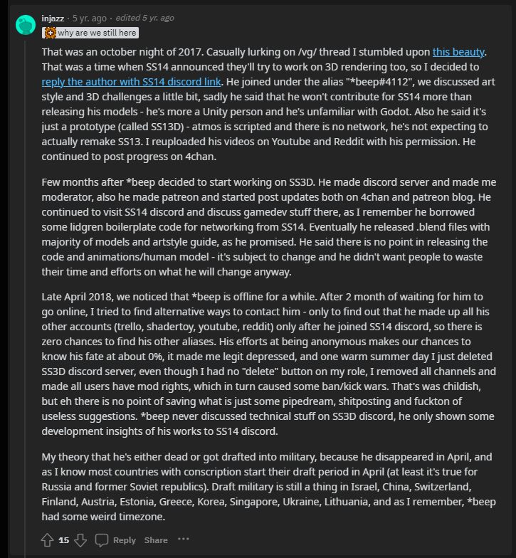

# History

In Jan 25, 2018, a user called \*beep created a Discord server for a project called SS3D.

In Dec 9, 2017 at 4:00 PM, \*beep created a Trello board to track down his SS3D project, this is the earliest known date relating to SS3D, as far as I know.

<figure><figcaption>
Closest person to *beep as far as we know commenting on the situation.
</figcaption></figure>


\*beep's ShaderToy account.



\*beep's YouTube.

