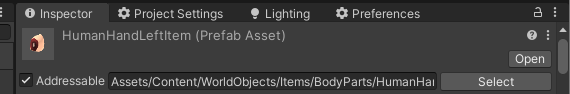

# Creating an Asset Database

1. Create an AddressableGroup for your assets. `(`<mark style="color:yellow;">`Window/AssetManagement/Addressables/Groups`</mark>`)`.
2. Set your assets as addressabble and in the groups menu drag them to your new group.
   1.

       <figure><figcaption></figcaption></figure>
3. Go to the **`Assets/Content/Data/Databases`** folder, and create a new AssetDatabase by going to <mark style="color:yellow;">**`Create/SS3D/AssetDatabase`**</mark>.
4. Set your AddressablesGroup in the inspector.
5. Go to <mark style="color:yellow;">**`ProjectSettings/SS3D/Assets/AssetDatabaseSettings`**</mark>
6. Press find and load asset databases.
7. Check if your new database code was generated in the **`Assets/Scripts/SS3D/Data/Generated`** folder

