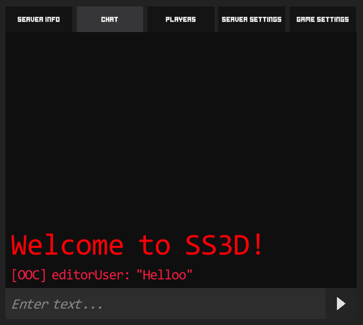

# 💬 Chat

SS3D has two types of chats available: the lobby chat and the in-game chat.

#### The lobby chat

The lobby chat is useful between rounds and for players that haven't embarked yet. The only channels that can be used there are the OOC channel and the System channel.

<figure><figcaption>
Lobby chat
</figcaption></figure>

The script in charge of handling the lobby chat is LobbyChatWindow, which can be modified in the Lobby GameObject inside the Game scene. The reason why the component is part of the Lobby and not the Chat itself, is because the chat gets disabled and enabled when using the tabs, and a disabled chat won't receive messages. This way, the chat is always enabled.

The lobby chat includes a delayed Welcome message, only sent to the player when they first join the server (before embarking). It can be useful to add some server-specific messages and information.

<figure><figcaption>
The Lobby Chat Window component
</figcaption></figure>

#### The in-game chat

The in-game chat is considerably more complex than the lobby chat. Apart of the System and OOC channels (also included in the lobby chat), it includes the rest of channels for both OOC and IC communication. A full list of current channels can be found at the end of this page.

<figure><figcaption>
In-game chat
</figcaption></figure>

The in-game chat window can have several tabs, where each tab includes a list of channels. When joining a round, the chat starts with a default "All" tab, which includes all channels available on start - like Local, OOC, etc. The player can add more tabs by pressing the plus ("+") button at the top left corner of the chat, selecting the desired channels and setting a custom name for the tab. Not selecting any channel will result in a tab with only non-hidable chat channels (like the System channel). The tabs can be reordered by dragging them around, and dragging them out of the tab list will create another chat window - so several chat windows can be opened at once.

<figure><figcaption>
The tab creator
</figcaption></figure>

On the bottom left corner, there's a dropdown to choose which channel to speak through. The list of channels depend on the current selected tab - so channels not part of the tab won't be available in the dropdown.

<figure><figcaption>
The channel dropdown
</figcaption></figure>

Finally, the in-game chat window can be resized and dragged around the UI, so the player can choose the layout they like the most.

#### Adding and modifying chat channels

Chat channels are implemented using ScriptableObjects. To add a new channel, just create a new Chat Channel with Right Click (on the Project folder) > Create > SS3D > UI > Chat > Chat Channel, and add it to the list of available channels in the ChatChannels asset settings.

<figure><figcaption>
Adding a new Chat Channel
</figcaption></figure>

There's a list of options to set up the channel to your needs: how to display the character name, the color and format of the chat, if it requires a trait to be used, if should only work within a distance, etc. Check the tooltips of each var for a more complete and updated information.

<figure><figcaption>
An example of a Chat Channel (Whisper channel)
</figcaption></figure>

#### Expanding the messages

The way messages are formatted, or the options of the channels, can be easily expanded by either modifying the ChatChannel.cs (for adding more variables) or the ChatMessage.cs (for modifying how a text is displayed). Chat messages are formatted only once - when the player sends it. This is done client-side.

<figure><figcaption>
FormatText method inside ChatMessage.cs
</figcaption></figure>

#### Current list of channels

### In-game channels

Station Alerts

* Who can use it: anyone for now, but should be limited to the captain (when that permission is created)
* Chats where is available: in-game
* Purposes: for sending messages to the whole crew, both from the captain and the game itself
* Color: dark yellow (we're running out of colors)
* Format: \[Station Alerts] CharacterName: "Message" // \[Station Alerts]: "Message" (if sent by computer)

Local

* Who can use it: anyone
* Chats where is available: in-game
* Purposes: for talking with people who are close
* Color: white
* Format: CharacterName says, "Message"
* Other: current distance is 5 Unity units in all directions

Public

* Who can use it: anyone with a headset
* Chats where is available: in-game
* Purposes: for talking with the whole crew from anywhere in the ship
* Color: green
* Format: CharacterName says, "Message"

Whisper

* Who can use it: anyone
* Chats where is available: in-game
* Purposes: for talking with people that are next to the character
* Color: light pink
* Format: CharacterName whispers, "Message"
* Other: current distance is 2 Unity units in all directions

Shout

* Who can use it: anyone
* Chats where is available: in-game
* Purposes: for talking with people that are farther and can't be reached with the General channel
* Color: light orange
* Format: CharacterName shouts, "Message"
* Other: current distance is 10 Unity units in all directions

AI/Binary/Command/Engineering/Medical/Science/Security/Service/Supply:

* Who can use it: anyone with a headset with the permission of the department (Security permission for Security channel and so on)
* Chats where is available: in-game
* Purposes: for talking with all the people from a specific department
* Color: AI: Pink / Binary: Black / Command: Yellowish Green / Engineering: Orange / Medical: Blue / Science: Purple / Security: Dark Red / Service: Green / Supply: Yellowish Brown
* Format: CharacterName says, "Message"
* Other: currently only Security is linked to the headsets as is the only permission (and headsets) that exist

### OOC channels

OOC:

* Who can use it: anyone
* Chats where is available: lobby and in-game
* Purposes: global OOC communication
* Color: pink/red
* Format: \[OOC] PlayerName: "Message"

LOOC:

* Who can use it: anyone
* Chats where is available: in-game
* Purposes: local OOC communication
* Color: beige
* Format: \[LOOC] PlayerName: "Message"
* Other: same distance than General - 5 Unity units in all directions

### Special channels

In Game System

* Who can use it: only through code
* Chats where is available: in-game
* Purposes: sending system messages to the player that shouldn't be in the lobby chat - like "unauthorized access to use channel X". Is a "last resource" channel for communicating with the character
* Color: red
* Format: Message
* Other: available in all in-game tabs, can't be hidden

System

* Who can use it: only through code
* Chats where is available: lobby and in-game
* Purposes: welcome message for the player in the lobby, server restart warnings. Is a "last resource" channel for communicating with the player, welcome message can be removed and keep it just for things like server restart or mod warnings
* Color: red
* Format: Message
* Other: available in all tabs, can't be hidden
