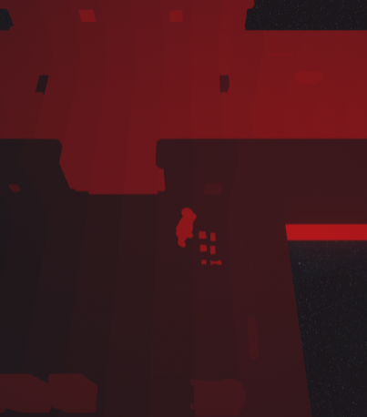

# How it works

The examine system uses an exotic way to pick up items.  The selection system uses a shader based method. A special camera renders the screen by defining for each object on scene which are selectable, an unique color. Then, the color under the mouse is picked up, and is used to find the game object with the unique color.

<figure><figcaption>
The special selection camera, rendering each object with unique colors (most colors are very close from each other)
</figcaption></figure>

