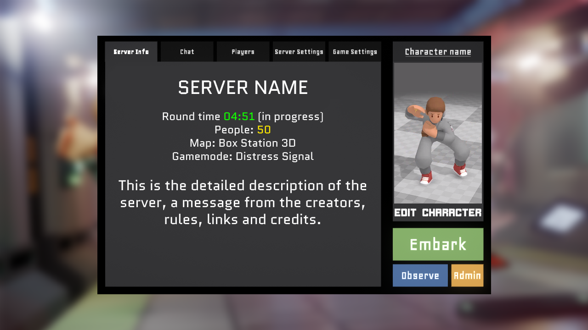

# Server Lobby

The Server Lobby is the menu for the individual server after you have chosen to connect to one via the Server Hub. From here you can join the round (if in progress) or spectate it.

It also serves several other purposes:

1. Provides server information/images custom to each server.

<figure><figcaption>
Server info menu
</figcaption></figure>

2. Includes a lobby chat to talk in OOC with the other people in the server.\
   (_needs image_)
3. Provides a list of players and possibly occupied roles.

<figure><figcaption>
Server players menu
</figcaption></figure>

4. Allows changing the game settings (video, audio, UI, etc.. as in [#in-game-settings](server-lobby.md#in-game-settings "mention")):

<figure><figcaption>
Settings menu
</figcaption></figure>

5. Allows editing/saving character presets at any point prior to embarking.\
   (_needs image_)
6. Grants server settings to admins so they change aspects of the round and start/stop rounds.\
   (_needs image_)
