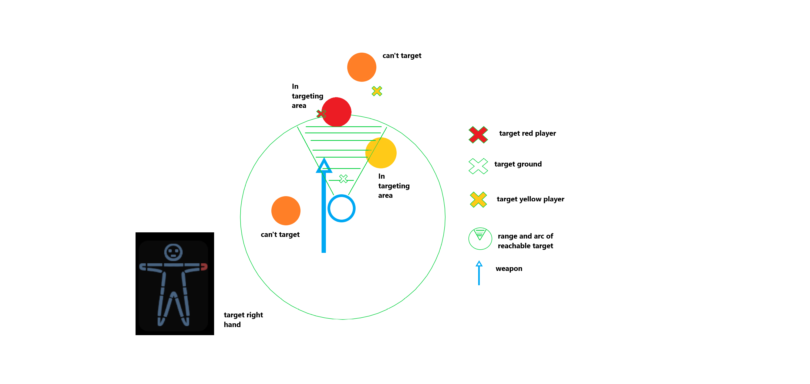

# Melee combat

## Range and Arc&#x20;

Different melee weapons have a different range and arc of reachable targets. A spear can reach far, but with a very narrow angle. A hammer has low range but with a wider arc of reachable target.

Below is a picture of a stun baton and a bat, and their respective arc and range. \
\

## Selecting targets in melee combat

Aiming in SS3D implies two things :&#x20;

* Selecting a target entity.
* Selecting a body part on this entity.

### Selecting a target entity in combat mode

Attacking a player happens when left clicking, therefore, click position matters to determine which entity to target.&#x20;

First, an entity must be reachable to be targeted, meaning it must be in the area determined by Range and arc of the melee weapon.&#x20;

#### Clicking directly on reachable entity

This one is simple, if the target is reachable and the click is on the entity, the entity is selected.

#### Clicking outside of arc and range

If the click occurs outside of arc and range of the weapon, the selected entity will be one that :&#x20;

* Is reachable.
* Is the closest from the player.

#### Clicking inside of arc and range

If the click occurs inside arc and range, even with a reachable entity, the target will be whatever was clicked on. This allow to smash an item (or just the ground) in close proximity of another player.

### Selecting a target entity out of combat mode

Out of combat mode, selecting a target relies solely on the interaction system, it therefore implies clicking on the target, and some checks are done to verify if the hitting interaction can occur.

Here's a drawing to sum it up :   (This one assumes direction of aim is following player's rotation, look at the **aiming's direction** part for more details on this particular point)

<figure><figcaption></figcaption></figure>

### Selecting a target body part

The consensus is that it's simpler for now to simply use the targeting doll to select the body part one's want to hit.

The targeting doll allows one in the UI to select any given body part on a humanoid character. In case where one of those body part would be missing, the next closest body part would be selected (missing right hand and right hand selected -> hit right arm).

## Aim's direction

In combat mode, the direction of hitting should follow the mouse, it's independent from character's body rotation (note that in this mode the character is strafing).

## Timing

Timing refers here to the time it takes between choosing a hit interaction, and landing the hit.&#x20;

A simple solution could be first to reduce this time to zero. However, we might note that it'd be hard to make sense of animations if a player takes a hit before the swinging animation of the weapon even started. This is a point to consider, ongoing discussion.

## Movement in combat mode

In combat mode, strafing will be the main way of moving around, with the player's torso direction following the mouse cursor.&#x20;
