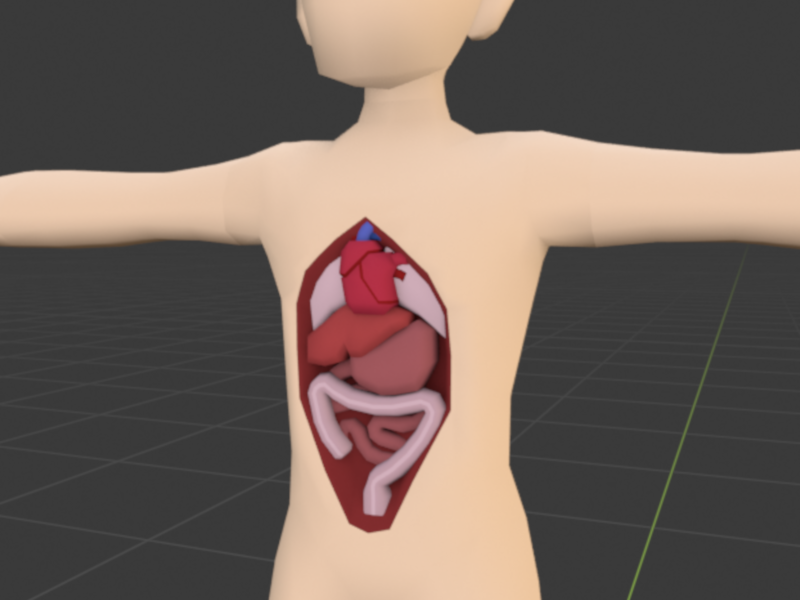

# Organs

## Organs 

<figure><figcaption></figcaption></figure>

Humanoids with organs can also suffer damage to specific organs, separate but still connected to the other damage types. To analyze organ damage, you need a health analyzer equipped with an organ scan upgrade, which will assess damage in these relative terms:

* 1-9: "Minor"
* 10-29: "Moderate"
* 30-64: "Significant"
* 65-99: "Critical"
* 100 and above: "Dead"

Usually, "Significant" and "Critical" are the most important ratings, for some organs cause extra problems upon reaching the "Critical" damage threshold.&#x20;

If left untreated, these problems can cause the organ to fail completely and die, resulting in the same effects as lacking one. Dead organs cannot be healed back to full health and thus require transplants.

Below is a breakdown of players’ organs, and what they do.

<table><thead><tr><th width="134">Organs</th><th>Function</th><th>Injury/Failure</th></tr></thead><tbody><tr><td>Brain</td><td>Controls all motor functions – speech, movement, and consciousness.</td><td>Reduces functions. Kills the player if the brain is dead.</td></tr><tr><td>Eyes</td><td>Allows the player to see.</td><td>Various degrees of visual impairments. Blurriness, blindness, etc.</td></tr><tr><td>Ears</td><td>Allows the player to hear.</td><td>Tinnitus, deafness.</td></tr><tr><td>Tongue</td><td>Allows the player to speak and taste.</td><td>Mute and loss of taste.</td></tr><tr><td>Lungs</td><td>Heals <mark style="color:blue;">oxygen</mark> damage, as long as it's intaking enough O2.</td><td>Lung failure or removal deals <mark style="color:blue;">oxygen</mark> damage over time.</td></tr><tr><td>Stomach</td><td>Allows players to eat.</td><td>Failure or death prevents the player from eating.</td></tr><tr><td>Intestines</td><td>Allows players to digest foods and absorb reagents.</td><td>Failure removes the player’s ability to absorb sustenance from food or reagents.</td></tr><tr><td>Liver</td><td>Depletes chemicals in the body, occasionally soaks up 1/12 of sustained <mark style="color:green;">toxin</mark> damage.</td><td>Liver failure or death causes fainting, halves the rate of chemical depletion, and deals <mark style="color:green;">toxin</mark> damage over time.</td></tr><tr><td>Kidneys</td><td>Having kidneys prevents not having kidneys.</td><td>Kidney failure or death deals <mark style="color:green;">toxin</mark> damage over time. Both kidneys dead or missing reduces chemical depletion by 50%.</td></tr><tr><td>Appendix</td><td>Small chance of causing appendicitis.</td><td>Failure may cause the appendix to explode, causing disease or major <mark style="color:green;">toxin</mark> damage.</td></tr><tr><td>Spleen</td><td>Regenerates blood.</td><td>Failure or death prevents the body from regenerating blood.</td></tr><tr><td>Pancreas</td><td>Depletes sugar in the body by producing insulin.</td><td>Failure or death stops pancreas from producing insulin. (Sugar in the body exceeding 200 units may cause a diabetic coma.)</td></tr></tbody></table>

While it may seem like a lot, **the majority of the organs perform their functions by simply existing. It’s when the organs fail, die, or go missing, is when the effects kick in.**

Organ failure occurs when an organ sustains 65% damage. Upon failing, the organ will slowly deteriorate, and eventually die, at which point a transplant is needed.
