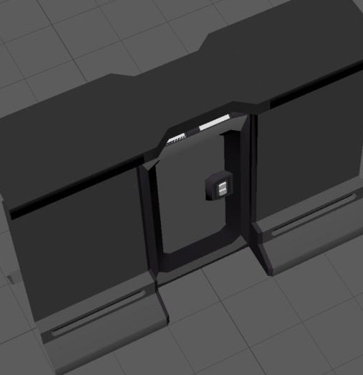
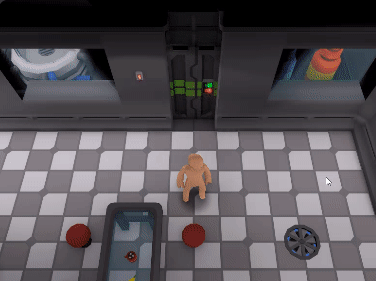
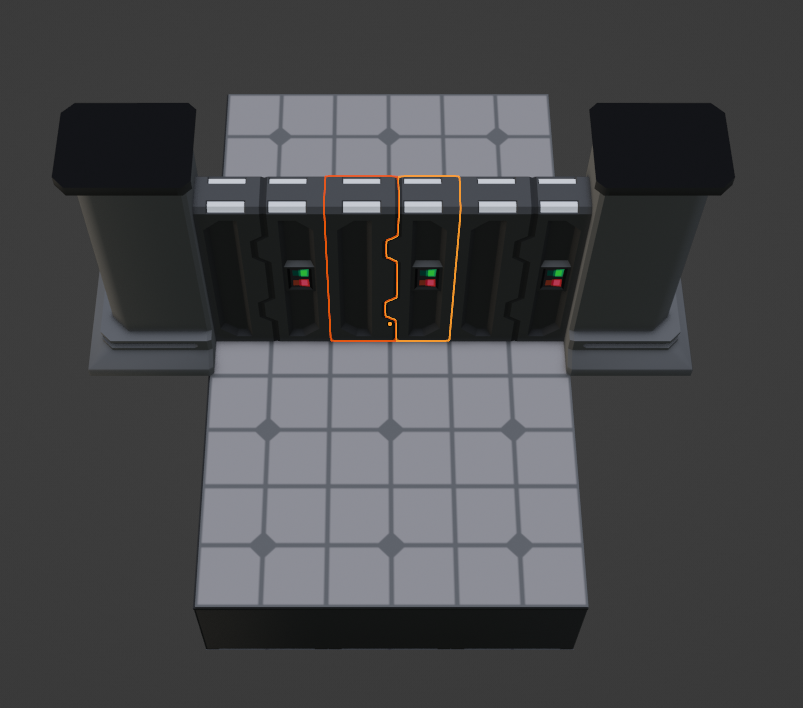
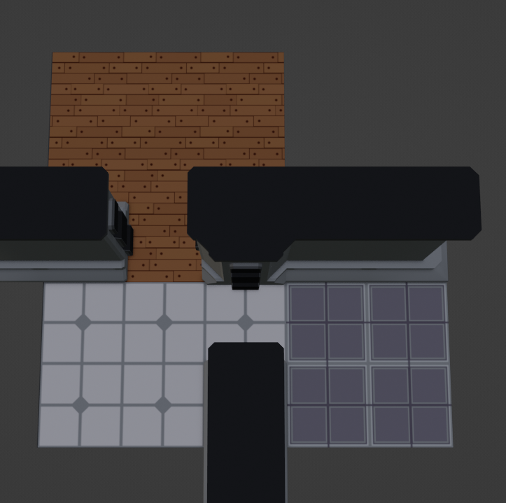
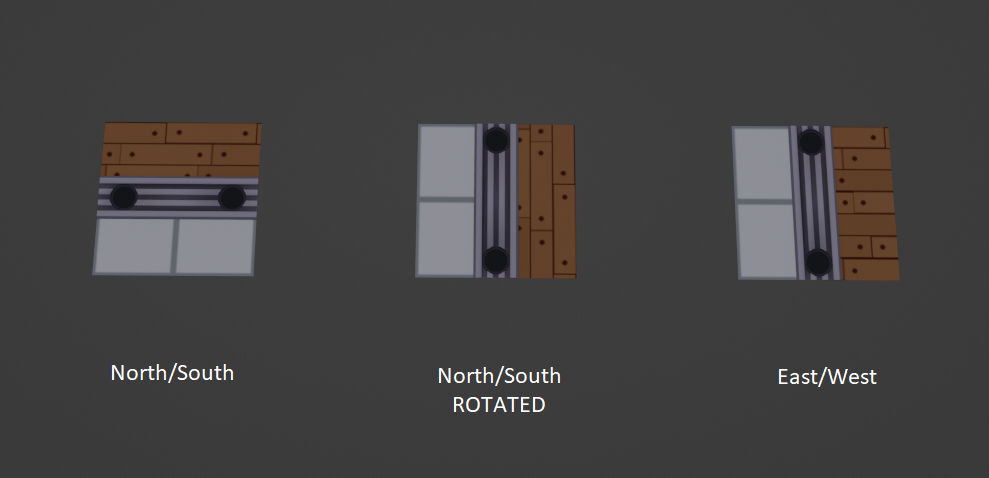

# Airlock Adjacency Connections

Airlock connections use the "Airlock Adjacency Connector" script. Airlocks are a (special) type of wall and thus connect to all types of walls and other airlocks based on requirements.

<figure><figcaption>
Operational door.
</figcaption></figure>

### Connecting to Walls

Airlocks connect to walls on either SIDE of them. Airlocks ignore connections in the front, back, and corners. If both sides ARE connected, the airlock becomes operational. If a wall on either side is destroyed or severely damaged, the airlock stops being operational.

<figure><figcaption>
Door entirely surrounded by walls. The door only connects to the walls on the sides.
</figcaption></figure>

#### Door Frames

Door frames are a required component when an airlock connects to a wall. Sometimes referred to as "wall caps". It is a small piece of wall that covers the connecting "gap" of the wall because the airlock does not have the same dimensions as the gap to cover it itself.

<figure><figcaption>
Notice you can see inside the wall when there are no wall caps.
</figcaption></figure>

Door frames themselves come in different material types based on the types of walls. The type of door frame used is dependent on the wall type it is connecting (metal door frame for metal walls, wood door frame for wood walls, etc.).

#### Door Caps


This sub-section may not be final.


Door caps are similar to that of door frames because they also are meant to fill the gaps left by doors. Door caps fill the gap between the top of the door, and the ceiling.

Door caps will likely be based on the connected wall type (not sure how to decide what type if the 2 airlocks on either side are different types) or airlock type. While some special airlock types may not require a door cap.

<figure><figcaption></figcaption></figure>

The example above is a static option but some people are not fond of it because it blocks the view of the airlock itself a bit and if you are a player and you open the door and stand in the open doorway, the door cap will obscure you or items behind it.\
\
One way to prevent this would be to use a cutout-shader on walls and also door caps, but another way is to simply make a retractable door cap like the example below. The difficulty here is making something to blend with the wall type and the airlock.

<figure><figcaption></figcaption></figure>

<figure><figcaption></figcaption></figure>

### Connecting to other Airlocks


This section may not be final.


Same as when connecting to walls, airlocks can only connect to other airlocks at their sides. This means that you must ensure both airlocks are rotated correctly for them to connect. Additionally, airlocks can only connect if they are the same base type.

Actually, airlocks don't "connect" to each other per se, rather once these conditions are met, they instead join as one object (in-game this will require the user to weld two airlock frames together to construct). They become a multi-tile airlock, and because of this are limited to 2-3 airlocks "connected" at time (based on airlock type).

<figure><figcaption>
3 airlocks.
</figcaption></figure>

<figure><figcaption>
A 3-tiled airlock (currently no 3 tile airlocks modeled, image is a stretched 2-tile airlock).
</figcaption></figure>

### Airlock Floor Tile

Airlocks because of their nature of being doors between different rooms, may be bridging two rooms with different floor tiles. Due to this, it is hard to determine what floor tile a airlock should have beneath the airlock itself.&#x20;

<figure><figcaption></figcaption></figure>

To resolve this we use a special floor tile for airlocks. It consists of two half tiles split with a metal track that the airlock slides on. The half tiles will use the texture based on the adjacent floor tile to blend the floors together at the doorway.

<figure><figcaption></figcaption></figure>

The only issue with this is that certain textures will break (wont tile properly) if you rotate the floor tile due to its custom UV. To prevent this we actually will use 2 airlock floors tiles, 1 for airlocks facing east/west and 1 for airlocks facing north/south.

<figure><figcaption></figcaption></figure>
